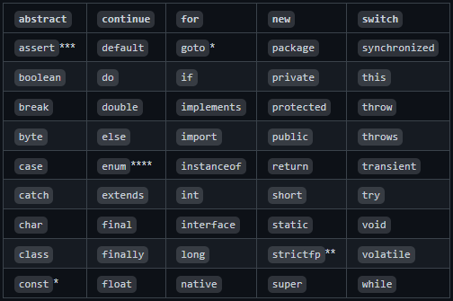
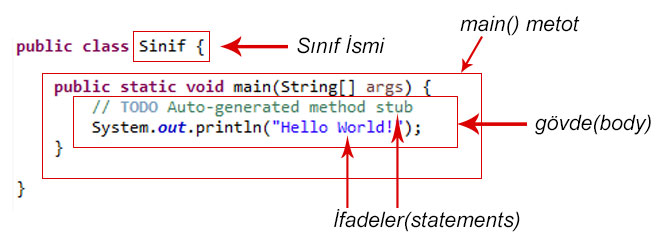
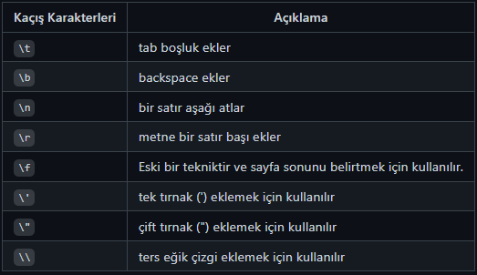
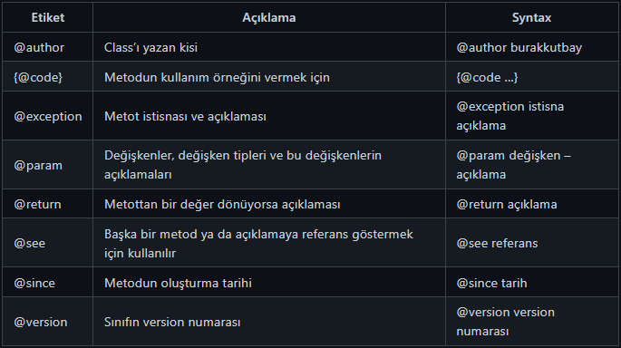

## Tavsiyeler:
* Eğitmen ile birlikte kod yazmaya çalışmayın.
* Anlamadığınız ve kafanıza oturmayan yerleri es geçmeyin, başka kaynaklardan araştırmalar yapın. Yine sonuç bulamazsanız bilen birilerine sormayı deneyin.
* Bol bol pratik yapın. Programlama öğrenmenin en önemli noktaları "Sabır ve Pratik"tir.
* Hata yapmaktan korkmayın. Kod yazarken hata yapma olasılığı çok yüksektir. Her seviyedeki programcı elbet bir yerlerde hata yapar.
* Tersine Mühendislik. Bir başkasının kodunu satır satır incelerseniz ve nasıl çalıştığını anlarsanız hem programlamaya bambaşka bir pencereden bakmış olursunuz hem de ufkunuzu genişletirsiniz.

## Temel Kavramlar
Programlama öğrenmeden önce, "Temel Kavramları" iyi öğrenmemiz gerekiyor.

## Program Nedir ?
Sözlükte program kelimesi, belirli şartlara ve düzene göre yapılması öngörülen işlemlerin bütünü ve aynı zamanda izlence olarak tanımlanmıştır. Yazılımcılara göre Program, bilgisayara bir işlemi yaptırmak için yazılan komutlar dizisidir.

## Programlama Nedir?


Programlama, “bilgisayara çeşitli görevleri yerine getirmesi için talimat vermenin” bir yoludur. Bu talimatlar, makinelerin nasıl çalışacağını veya çalıştıracağını söyleyebilir. Programlama bilgisayar ne yapması gerektiğini söyleyen, problemlere çözümler üreten ve bu çözümleri algoritmalar ile destekleyen bir öğretme işlemidir.


Günümüzde bir çok özelliğe sahip, işlem güçleri yüksek bilgisayarlar veya donanımlar mevcut. Hatta süper bilgisayar olarak adlandırılan milyon dolarlar harcanan donanımlar bile kullanılıyor. Ama bu bilgisayarlara ne yapacağını söylemediğiniz sürece, dünyanın en vasıfsız cihazlarından bir farkları olmayacaktır. Bilgisayarları hayatımızda bu kadar önemli hale getirmek için programlama tanımı devreye girmektedir.


## Algoritma Nedir?


Algoritma belirli bir problemi çözmek veya belirli bir şartı sağlamak için tasarlanmış yoldur .Bilgisayar bilimlerinde ve Matematikte bir işi yapmak için oluşturulan, başlangıç ve bitiş noktası olan sonlu işlemler kümesidir. Bilgisayar bilimlerinin önemli bir parçası olup , programlamada kullanılır. Tüm programlama dillerinin temelleri algoritmaya dayanır.


Bir bilgisayarları harekete geçirmek için, bilgisayar programları yazmak gerekmektedir. Bir program yazmak için, bilgisayar adım adım, tam olarak ne yapmak istediğini söylemek gerekir. Bilgisayar daha sonra bu adımları izleyerek istediğimiz eylemi gerçekleştirir.


Bilgisayara ne yapacağınızı söylediğinizde, bunun nasıl yapılacağını da seçersiniz. İşte burada bilgisayar algoritmaları devreye giriyor. Algoritma işi yapmak için kullanılan temel tekniktir. Algoritma kavramını anlamanıza yardımcı olacak bir örnek izleyelim.


Başka şehirden bir arkadaşınız sizi ziyarete gelecektir. Arkadaşınızın havaalanından evinize gelmesi gerektiğini varsayalım. İşte arkadaşınıza evinize gelmesi için verebileceğiniz dört farklı algoritma :


* Taksiye bin 
* Araç kirala 
* Otobüse bin 
* Ben seni alırım 

Bu algoritmaların dördü de tamamen aynı hedefe ulaşır, ancak her algoritma bunu tamamen farklı bir şekilde yapar. Her algoritmanın farklı bir maliyeti ve farklı bir seyahat süresi vardır. Örneğin bir taksiye binmek muhtemelen en hızlı, ama aynı zamanda en pahalı olanıdır. Otobüse binmek kesinlikle daha ucuz, ama çok daha yavaş. Algoritmayı koşullara göre seçersiniz.


Bilgisayar programlamada, verilen herhangi bir görevi yerine getirmenin birçok farklı yolu vardır. Her algoritmanın farklı durumlarda avantajları ve dezavantajları vardır. Bizler en uygun algoritmaları seçmeye çalışırız.


 


## Programlama Dili Nedir?


Dil, binlerce yıldır insanlar için iletişim aracı olmuştur. Bir topluluk için, dil insanların iletişim kurması gereken kelimeleri içeriyordur. Bilgisayarlara baktığımızda da , bu durumun çok farklı olmadığını göreceksiniz. Birbirleriyle iletişim kurması gereken bir çok donanım ve yazılım bileşenleri vardır.


Eski bilgisayarlar aslında devre ve kabloların yerleriyle oynayarak bir ve sıfırların elle değiştirilmesiyle programlandı. Tabii ki, bu tür ilkel programlar için kullanılan yöntem zordu. Bu nedenle programlama dillerinin oluşturulması, bilgisayar bilimlerini başka bir seviyeye taşıyan devrim niteliğinde bir adımdı. Normal dillerden farklı olarak, programlama dillerindeki anahtar kelimeler sınırlıdır. Bu kelimeleri birleştirerek , programcılar farklı türlerde programlar oluşturabilirler. Yazılan kodları makinenin anladığı dile dönüştüren ara birimlerde mevcuttur.


"Programlama Dili , insanların bilgisayarlarla etkileşime girdiği bir dizi talimattır."


 


## Sözdizimi (Syntax) Nedir?


Syntax (Sözdizimi), yazılan herhangi bir sözün sırasıyla ilgilenen bilim dalıdır. Türkçede cümlelerin ögelerinin diziliminin bir sırası söz konusuysa diğer programlama dillerinde de aynı şey söz konusudur. Programlama dillerinde de tıpkı bizim günlük hayatta kullandığımız dilde olduğu gibi belli dizilim kuralları vardır. Bu dizilim kuralları sayesinde her şey makineler ve insanlar tarafından daha rahat anlaşılabilir ve yorumlanabilir bir hal almaktadır. Bunların dışına çıkıldığında veya bir eksiklik yapıldığında o kod satırı tam olarak yorumlanamaz ve hatayla karşılaşılır. Buna da Syntax Error adı verilmektedir.


# Java Nedir ?


## Java Tarihçesi


1991 yılında Sun Microsystems şirketi mühendislerinden James Gosling ve 12 arkadaşı Green Project(Yeşil Proje) isimli bir proje geliştirmeye başladılar. Gömülü Sistemler üzerine çalışan James Gosling ve ekibi başlangıçta C ve C++ dillerini kullansalar da bu dillerin geliştirdikleri projeye uygun bir dil olmadığını ve geliştirdikleri proje için yetersiz olduğunu görüp yeni bir arayış içine girdiler ve bu sırada “Oak” şimdiki adıyla Java dili doğmuş oldu.


Java, doğrudan C++ ile bağlantılıdır. C++ ise C’nin devamıdır. Java, karakteristik özelliklerinin birçoğunu bu iki dilden almıştır. C’nin sözdizimi (syntax), C++’ın ise nesne yönelimli programlama (object oriented programming- OOP) kavramları Java’ya miras kalmıştır. Bunun yanı sıra, Java, bu dillerdeki karmaşıklığı ortadan kaldırmış, eksik özelliklerini ise tamamlamıştır.


## Java'nın Avantajları Nelerdir ?


### Basit Olması


Java’nın yazımı kolaydır. daha okunaklı bir yapısı vardır ve dikkat çekicidir. Java geleceğe dönük olarak oluşturulacak yapılarla kullanımı kolaylaştırılır, sadeleştirilir ve öğrenmesi kolaydır.


###  Tarafsız Mimariye Sahip


Java özel makinelere ya da işletim sistemi mimarilerine bağlı değildir. Java donanımdan bağımsızdır. Java'yı platform bağımsız kılan özelliği yazılan kaynak kodlar derlendikten sonra ara bir dil olan byte code'a çevrilmesidir. Ara dile çevrilen bu kod parçaları Java Virtual Machine vasıtasıyla yorumlanır ve çalıştırılır. Buradaki tek sorun hız sorunudur. Çünkü işletim sistemiyle birlikte Virtual Machine’de bilgisayarın kaynaklarını kullandığı için daha yavaş çalışmaktadır.


###  Nesne Yönelimli Olması


Java da C++ gibi nesne yönelimlinin özelliklerinden faydalanır. Sınıflar oluşturularak daha az kod yazıp daha fazla iş yaparak kod tekrarı önlenmiş olur. Böylece geliştirme sürecinin verimliliği artar.


###   Zengin Kütüphane Desteği


Java çok zengin ve geniş bir kütüphaneye sahiptir ve ücretsiz olarak erişim sağlayıp temin edilebilir. Bu sayede bir çok platformda uygulama geliştirme imkanı sağlar.


###  Multi-Thread & Dinamik


'Multi-Thread' bir programda bir çok işlemin aynı zamanda gerçekleşmesi özelliğidir. Eş zamanlı işlemleri programlayabilmenize imkan tanır. Java bu tür program geliştirmeye destekler.


###  Neden Java Kullanmalıyız ?


Bilgisayarlarının %97'sinde Java Bulunuyor.


Dünya’da 9 Milyon Java Geliştiricisi Var


3 Milyar Cep Telefonunda Java Bulunuyor


125 milyon TV cihazı Java kullanıyor


Dizüstü bilgisayarlardan veri depolama merkezlerine, oyun konsollarından bilimsel süper bilgisayarlara, cep telefonlarından Internet'e kadar Java her yerde!


###  Java ile Uygulama Geliştirme Yapabileceğiniz Alanlar


Teknoloji ve onları geliştirmek için kullanılan diller sürekli bir evrim geçirmekte. Java dili, çok sayıda uygulamaya sahip popüler programlama dillerinden biridir. Java ile ne tür uygulanalar yapılabilir ?


 Mobil Uygulamalar : Java, mobil uygulama geliştirme için çok kullanılan bir programlama dilidir. Android Studio ve Kotlin gibi yazılımlarla uyumludur. Çünkü Android İşletim Sistemi Java ile yazılmıştır. Android'in sınıf dosyalarını yürütmek için DVK (Dalvik Virtual Machine) kullanırken Java Virtual Machine (JVM) üzerinde çalışmaktadır. Java ve OOP ilkeleri ile Android ile daha iyi güvenlik ve basitlik sağlar. 
 Masaüstü Uygulamalar : Masaüstü uygulamaları Java ile kolaylıkla geliştirilebilir. Java ayrıca AWT, Swing ve JavaFX gibi eklentileri ile arayüz geliştirme desteği ve kolaylığı sağlar.
 
 Web Tabanlı Uygulamalar : Java, web uygulamaları geliştirmek için de kullanılır. Servlets, Struts veya JSP eklentileri ile web uygulamaları için geniş destek sağlar. Bu teknolojiler sayesinde ihtiyacınız olan her türlü web uygulamasını geliştirebilirsiniz.
 
 Kurumsal Uygulamalar : Java en çok talep gören programlama dillerden biridir. Büyük ve küçük işletmeler, bu dilde yazılmış uygulamalarla desteklenmektedir. Bu, yenilikçi bir ticari yazılım türü fikriniz varsa, Java muhtemelen sizin için en iyi dildir demektir. Havayollarının, devlet kurumlarının her gün kullandığı özel işletme yazılımlarının çoğu için de geçerlidir.
 
 Bilimsel Uygulamalar : Bilimsel hesaplamalar ve matematiksel işlemler yaptırmak için Java çok kullanılan bir dildir. MATLAB gibi en popüler uygulamalardan bazıları, GUI (Arayüz) ve çekirdek yapılarında Java kullanır.
 
 Oyun Programlama : Java, bağımsız oyun geliştirme şirketleri tarafından ve mobil oyunlar oluşturmak için yaygın olarak kullanılmaktadır. Java, 3 boyutlu oyunların tasarımı söz konusu olduğunda benzersiz bir yeteneğe sahip olan açık kaynaklı 3D Motor olan jMonkeyEngine'in desteğine sahiptir. Dünyanın en iyi mobil oyunlarının çoğu Java'da geliştirilmiştir. Minecraft, Mission Impossible III ve Asphalt 6 vb.
 
 Gömülü sistem uygulamaları geliştirebilirsiniz. (Java2ME Embedded altyapısı ile) Java, gömülü sistem tasarımcıları için bir dizi avantaja sahiptir. Java, dil olarak, C ++ tehlikeleri olmadan nesne yönelimli programlamaya izin verir. Örneğin, Java sınıf kalıtımına izin verir, ancak birden çok ebeveynden gelmez, bu nedenle kafa karışıklığı fırsatı yoktur. Ayrıca Java, teknoloji geliştiricilerinin değişen pazar koşullarına hızla yanıt vermesini mümkün kılar. Uygun şekilde uygulanırsa, gömülü bir uygulamanın Java bölümleri uygulamanın geri kalanından izole edilebilir, böylece görev açısından kritik bölümleri Java bölümlerinin yol açtığı bozulmaya karşı korur.
 


# Java’da Yazım ve İsimlendirme Kuralları


# Yazım Kuralları


 Türkçe Karakter Kullanımı : Java ve bir çok programlama dili Türkçe karakter desteklememektedir. Programda ki metin ifadeleri dışında Türkçe karakter kullanılmamalıdır. Türkçe Karakterler : ç, ı, ü, ğ, ö, ş, İ, Ğ, Ü, Ö, Ş, Ç 
 Harf Duyarlılığı : Java harfe duyarlı bir dildir. Kelimelerdeki küçük ve büyük harfler farklı olarak algılanır. Java’da Kodluyoruz ile kodluyoruz farklı anlama gelmektedir. 
 Sınıf Adları : Java’da sınıf adlarının ilk harfi büyük olmalıdır. Eğer 2 kelimeyi birleştirerek bir sınıf adı oluşturursak bu isimlerin baş harfleri büyük olmalıdır. Örnek: CamelCase 
 Metot Adları : Metot adları küçük harfle başlar. Metot adı verilirken iki kelime birleştirilecekse ismin başlangıç harfi küçük diğer birleştirilen kelimelerin başlangıç harfleri büyük yazılır. Örnek: camelCaseOrnek 

# İsimlendirme Kuralları


Camel Case Nedir ?


Camel Case, bir bileşik sözcük içindeki her kelimenin ilk sözcük dışında ki sözcüklerin ilk harfleri büyük harflerle yazıldığı bir adlandırma kuralıdır. Yazılım geliştiricileri genellikle kaynak kodu yazarken "Camel Case" kullanır. Camel Case kullanımı zorunlu bir kullanım olmasa da yazılım dilinin jargonudur ve genelde tüm yazılımcılar bu kurala uyar. Bu kural sayesinde değişken isimleri daha okunur olur.


Örnek : patikaDev, camelCaseKurali, javaPatikasiBasliyor


### Upper Camel Case Nedir ?


Upper Camel Case isimlendirme kuralı ise, bileşik bir sözcükteki tüm sözcüklerin ilk harflerinin büyük olmasıdır.


Örnek : PatikaDev, UpperCamelCaseKurali, JavaPatikasiBasliyor


Kelimeler alt tire (_) ile birbirine bağlanır.


Upper snake case örnek: Hello_World


Lower snake case örnek: hello_world


### Screaming Snake Case


Bütün harfleri büyük yazılır. Genellikle sabit isimlendirmede kullanılır.


# Java'da İsimlendirme Kuralları


 Java'da isimlendirilen tüm ögeler sadece A-Z veya a-z gibi harfler, $ karakteri veya _ karakteri ile başlayabilirler. 
 Keyword’ler (Yasaklı Kelimeler) isimlendirmede kullanılamaz 



 * Sınıflar için upper camel case kullanılır. HelloWorld 
 * Metotlar için lower camel case kullanılır. helloWorld 
 * Değişkenler için lower camel case kullanılır. helloWorld 
 * Sabitler için screaming snake case kullanılır. HELLO_WORLD 

# 📘 Main Metodu ve Kullanımı

ava'da bir program çalışacağı zaman, kodlar ilk olarak main metodu içerisinden başlar. Main metodu sayesinde derleyiciye, programı buradan başlatılması konusunda referans oluşturulur.

````
public class JavaPatika {
    public static void main(String[] args) {
        System.out.println("Hello World!");
    }
}
````
Artık programı çalıştırdığımızda, derleyici ilk olarak main metodu okuyup sonrasında gerekli işlemleri yapacaktır.


Main metodu yazılırken, args yerine başka bir isimlendirme yapılabilir. Ancak genellikle args sözcüğü kullanılır ve bu sözcük arguments sözcüğünün kısaltmasıdır. Arguments ile ifade edilen kısım, sınıf çalıştırılırken JVM tarafından bu sınıfa verilen parametrelerdir.


# Programlamaya Başlangıç


İlk öğreneceğimiz kod parçacığı, Java'da ekrana veri bastırma kodu olan System.out.println("Java101"); komutunu öğreneceğiz. Ama ilk önce bilmemiz geren bir konu Java'da kodların nereye yazıldığı ve yazım kuralları ya da diğer adıyla söz dizimi (Syntax). Genellikle Syntax olarak İngilizce adıyla duyduğumuz bu terim herhangi bir programlama dilinin yazım kuralını belirler.


# Genel Sözdizimi (Syntax)



Yukarıda ki örnekte göreceğiniz gibi, en üst kısımda "public class Sinif" komutu ile bir sınıf (class) oluşturuyoruz. Java'da sınıflar içerisine kodlarımızı yazarız ve ilerleyen derslerde sınıflar konusuna derin bir giriş yapacağız. Daha sonra program çalıştığında çalışan bir metot olan "Main Metodu" sınıfımızın içerisine yazarız çünkü programı çalıştırmak için derleyici ilk olarak main metot içerisindeki komutları okuyacaktır.


Main metot içerisine "Gövde (body)" adını veririz ve komutlarımızı ya da diğer adıyla ifadelerimizi gövde içerisine yazarız. Buraya yazdığımız kodlar derleyici tarafından yorumlanır ve çıktı olarak kullanıcıya verir. Genel olarak Java'nın Genel Sözdizim kuralları bu şekildedir.

# Ekrana Veri Yazdırma

Java'da ekrana veri yazdırmak için System.out.print("Hello World!") kod parçacığı kullanılır. Bu komuta baktığımızda, iki parantez arasında, çift tırnaklar arasına ekrana yazdırmak istediğimiz sözcüğü yazmalıyız. Bu komutun iki farklı kullanım şekli mevcuttur, yazılan komuttan sonra yeni satıra inilmesi isteniyorsa System.out.println(); kullanılırken aynı satırda kalınması isteniyorsa System.out.print(); şeklinde kullanılır.

# Escape Karakterler

Java'da Escape (Kaçış) karakterleri ile bazı özel durumlar durumlar gerçekleştirilir. Kaçış karakterleri ( / ) ters eğik çizgi ile ifade edilip sonrasında yazılan karakter ile özel işleve sahip olurlar.



# 📘 Yorum Satırları

Yorum satırları, kod içi belgeleme amacıyla kullanılan ve derleyiciler tarafından dikkate alınmayan kod parçalarıdır. Yorum satırları oluşturmamızın sebebi, Yazdığı kodun kritik kesimlerini açıklayarak, o koda daha sonra bakan kimselerin (büyük olasılıkla kendisinin) işini kolaylaştırmak amaçlanmaktadır. Java’da yorum satırları 3 farklı şekilde yazılır:

## // ile yapılan yorumlar

Tek satırlık bir açıklama yapılacaksa o satırın başına // işareti yazılır. ; // işaretinden sonra satır sonuna kadar her şey yorum olarak kabul edilir. Anlaşılacağı üzere bu işaretin satırın en başında olması zorunlu değildir. Ancak kodlama alışkanlığı bakımından satır başında kullanılması daha uygundur.

````
// bu bir yorum satırıdır
int number = 10; // number değişkenine 10 değeri atandı.
````
## /* ... */ ile yapılan yorumlar

Eğer birden fazla satırda yazılan bir açıklama varsa, her satırın başına // işareti koymak programcıya zor gelebilir. Bunun yerine, açıklama olarak değerlendirilmesi istenen satırlar /* ve */ işaretleri arasına alınır. Bu iki işaret arasında kalan kesimler derleyici tarafından yorum satırı olarak kabul edilir.

````
/* Birden fazla satırdan oluşan bir yorum satırlarıdır. Ancak yorumların bu yolla ifade edilmesi için birden fazla satırdan oluşması zorunluluğu yoktur. */
int number = 10; // number değişkenine 10 değeri atandı.
````
## /** ... */ ile yapılan açıklamalar

Bir uygulama geliştirilirken kod içi belgeleme yapmak güzel bir programlama alışkanlığıdır. Çünkü hem yapmakta olduğunuz işi en güzel o işi yaparken açıklayabilirsiniz, hem de açıklayabildiğiniz kodu anlamışsınız demektir ve o kodu açıklayarak yazdığınız için hata yapma olasılığınız düşer.


Öte yandan, çoğu zaman uygulamaların raporlarının oluşturulması gerekir. Kod yazıldıktan sonra kodun içine yazılan açıklamalardan bir belge oluşturarak bu belgeyi raporun sonuna eklemek programcının yükünü hafifletecektir. İşte şimdi bahsedeceğimiz üçüncü yöntem bu amaçla kullanılır. /** ve */ işaretleri arasına yazılan açıklamalar bir takım özel etiketler içerebilir. Kod içi belgeleme, bu etiketleri tanıyan ve etiketlerden faydalanarak belge üreten bir aracın yardımı ile belgeye dönüştürülebilmektedir.


Bu tarzda yazılan açıklama satırlarına Javadoc adı verilmektedir. Javadoc için kullanılabilecek bazı örnekler ve ne için kullanılabilecekleri aşağıda listelenmiştir:



````
/**
 * @author M.Mustafa Çetindağ - 11.Nis.2021
 */
public class AciklamaSatiriOrnegi {
    /**
     * Verilen sayının karekökünü bularak döndürür.
     * Sayının sıfırdan küçük olmadığını varsayar.
     *
     * @param sayi Karekökü alınacak sayı
     * @return Sayının karekökü
     */public double karekok(double sayi) {
        double kkok = 0;
        // burada karekök bulma algoritmasının çalıştığını kabul edelimreturn kkok;
    }
}
````

Eğer birden fazla satırda yazılan bir açıklama varsa, her satırın başına // işareti koymak programcıya zor gelebilir. Bunun yerine, açıklama olarak değerlendirilmesi istenen satırlar /* ve */ işaretleri arasına alınır. Bu iki işaret arasında kalan kesimler derleyici tarafından yorum satırı olarak kabul edilir.