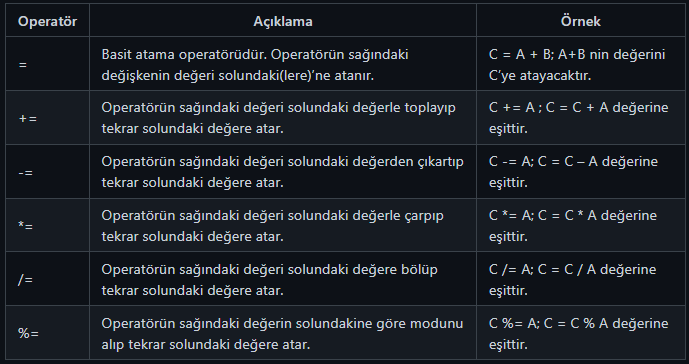
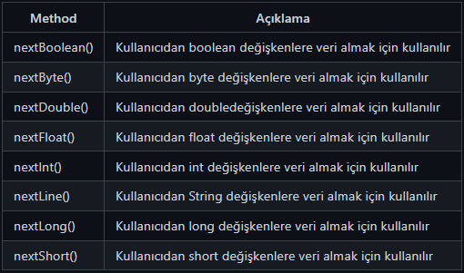

# Değişkenler ve Veri Tipleri


Değişkenler programlamada geçici bilgileri sakladığımız ve programcı tarafından belirlenen yapılardır. Değişkenler programlamanın temel yapısını oluşturmaktadır ve tüm programlama dillerinde kullanılan bir yapıdır. Değişkenler sayesinde program içinde yaptığımız işlemleri hafıza da tutar ve gerektiği yerlerde kullanırız. Değişkenlerin 4 özelliği bulunur ; Veri Tipi, İsim, Değer ve Adres.


Değişkenlerde Veri Tipi, adından da anlaşılacağı üzere verinin saklanacağı türünü belirtmektedir bunlar sayılar, sözcükler ve programatik alanlar olabilir. Her değişkenin program içinde kullanıldığı ve çağrıldığı benzersiz bir ismi vardır. Bu değişkenlere birde değer atarız , işletim sistemimizde bu değişkeni hafızada tutar ve bir adres belirler.


Java'da değişkenlerin veri tipleri vardır. Bu tipler Java'da varsayılan olarak tanımlı gelen ilkel tipler (primitive) de olabilir yahut yazılımcıların kendi tanımladığı ilkel olmayan tipler (non-primitive) de olabilir. İlkel tipler her zaman bir değere sahiptir. İlkel olmayan tipler ise 'null' (boş) olabilir. İlkel olmayan türlerin tümü aynı boyuta sahipken ilkel veri tiplerin boyutu alacağı veri tipine bağlıdır.


Java Değişken Tanımlama


````<veri tipi> <değişken ismi> = veri (değer) ````


İlk önce değişkenin veri tipini ve değişkenin ismini yazarız ve istenirse aynı matematikteki gibi "=" eşittir ile değerini atarız.

````
int number;
// number isminde, int veri tipinde bir değişken tanımlanmış
````
Veri tipleri aynı olan değişkenleri aynı satırda tanımlayabiliriz


````
int a, b, c;
// int veri tipinde 3 tane değişken tanımlanmış
````
Değişkeni tanımladıktan sonra, atama operatörü (=) kullanarak değişkene atayabiliriz.

````
double pi; // ilk başta double türünde bir değişken tanımladık
pi = 3.14; // Daha sonra bu değişkene bir değer atadık
````
Eğer bir değişkene hemen değer atayacaksanız, bunu iki satırda yapmak yerine tek bir satırda halledebilirsiniz.

````
double pi = 3.14;
````
Aynı satırda aynı türden birden fazla değişken tanımlıyorsak :

````
int a = 1 , b = 2;
// Aynı satırda int türünde 2 farklı değişken tanımlanmış ve ikisine de değer verilmiş
````
Değişkene verilen değer sonrasında değiştirilebilir, ama aynı isimde ikinci bir değişken oluşturulamaz ve hata alırız.


Hatalı Kullanım :

````
int a = 5; // a isminde bir değişken tanımlanmış
int a = 1 ; // Bu satır hataya neden olur, a değişkeni zaten var
````
Doğru Kullanım :

````
boolean a = true; // a isminde bir değişken tanımlanmış ve varsayılan bir değer verilmiş
a = false; // a değişkeninin değeri değiştirilmiş
````
Java'daki İlkel Veri Tipleri


 * Tam Sayılar 
 * Byte 
 * Short 
 * Integer 
 * Long 
 * Ondalıklı Sayılar 
 * Float 
 * Double 
 * Karakterler 
 * Char 
 * Mantıksal Değerler 
 * Boolean


# Byte, Short, Int ve Long Veri Tipleri

Java'da tam sayıları belirten veri tipleri Byte, Short, Integer ve Long'tur.


#### Byte

 8 bit uzunluğundadır. Max 127 , Min -128 değerleri arasındadır. 
 Anahtar sözcük : byte 

#### Short

 16 bit uzunluğundadır. Max 32,767 , Min -32,768 değerleri arasındadır. 
 Anahtar sözcük : short 

#### Integer

 32 bit uzunluğundadır. Max 2,147,483,647 , Min -2,147,483,648 değerleri arasındadır. 
 En çok tercih edilen veri tipidir , sebebi ise optimize uzunluktadır. 
 Anahtar sözcük : int 

#### Long

 64 bit uzunluğundadır. Max 9,223,372,036,854,775,807 , Min -9,223,372,036,854,775,808 değerleri arasındadır. 
 Int’in yetersiz olduğu yerlerde kullanılır 
 Anahtar sözcük : long 
 

````
public class JavaPatika {
    public static void main(String[] args) {
        byte a = 120;
        short b = 1000;
        int c = 100000;
        long d = 10000000;
    }
}
````

# Float ve Double Veri Tipleri

Java'da ondalıklı yani küsuratlı sayıları belirten veri tipleri Float ve Double'dır.


#### Float


 32 Bit boyutundadır ve 1.4×10^-45 ile 3.4×10^38 aralığında bir değer tanımlanabilir. 
 Float içerisine tam sayı yazdığımız zamanda bile o sayı 1.0 şeklinde ondalıklı olarak algılar. 
 Float ile double ayırmak için , float tanımlamalardan sonra ‘f’ veya ‘F’ konulmalıdır. 
 Anahtar Sözcük : float 

#### Double


 64 Bit boyutundadır ve 4.9×10^-324 ile 1.8×10^308 aralığında bir değer tanımlanabilir. 
 Üst düzey matematiksel işlemlerde kullanılır 
 Anahtar Sözcük : double 

#### Ondalık Sayı Veri Tiplerinden Hangisi Tercih Edilmelidir ?


Bu sorunun cevabı değişken olmakla beraber hangi durumlarda Double veya Float kullanımınız için dikkat etmeniz gereken hususlar


 Double tipi, yüksek duyarlıklı ve hassas matematiksel işlemlerde kullanılır. 
 Float basittir : hız ve bellek. 
 Double daha yavaş ve fazla yer kaplar.(Bu işlemler arasında milisaniye oynar) 
 Java hassas matematiksel işlemler, örneğin sinüs kosinüs fonksiyonları, double tipi değer döndürür. 
 

````
public class JavaPatika {
    public static void main(String[] args) {
        float number1 = 3.14F;
        float number2 = 3.14f;

        double number3 = 3.14;
    }
}
````
# Char ve Boolean Veri Tipleri

#### Char


Java'da karakter değişkenleri saklamak için Char kullanılır. Char veri tipleri birleşerek String Sınıfından bir yapıya dönüşür.


 Karakterler Char ile saklanır. 
 Diğer dillere göre Char Java’da 16 bittir. 
 Java Unicode karakter setini kullanır ve tüm dilleri içerir. 
 Java evrensel bir dil olarak tasarlandığı için karakter seti de evrensel set olan Unicode ile tanımlanmıştır. 
 Anahtar Sözcük : char 

#### Boolean


Java, mantıksal değerleri saklamak için boolean adında bir tipe sahiptir.


 Boolean sadece iki değer alabilir : True ve False 
 Genellikle koşul ve döngü işlemlerinde, kontrol amaçlı olarak kullanılır. 
 Anahtar Sözcük : boolean 
 
````
public class JavaPatika {
    public static void main(String[] args) {
        char letter = 'u';
        boolean logic1 = true;
        boolean logic2 = false;
    }
}
````

# String Veri Tipi
String sınıfı java.lang kütüphanelerinde bulunan ve metinlerle ilgili her türlü işlemin yapıldığı sınıftır. Java'da genellikle kelime tutmak için char yerine String sınıfı kullanılır. Basitçe şöyle düşünebiliriz , Char veri tipi tek bir karakter tutabiliyorken, charların birleşmesiyle oluşan sözcükleri String Sınıfı tutmaktadır.
````
public class JavaPatika {
    public static void main(String[] args) {
        String words = "Hello World";
    }
}
````

# Temel Operatörler

Java dilinde operatörler birçok işlemi yapabilmenize olanak tanır. Örneğin: matematiksel operatörlerle birlikte aritmetik işlemler yapabilmenizi, ilişkisel operatörlerle verileri kıyaslayabilmeyi, atama operatörleri ile değişkenlerin değerlerini değiştirmeye fırsat verir.


Java'da operatörler aşağıdaki gibi listelenebilir:


* Atama Operatörleri 
* Aritmetiksel Operatörler 
* İlişkisel ve Eşitlik Operatörler 
* Koşul Operatörler 
* Mantıksal Operatörler 


## Atama Operatörü


## Aritmetik Operatörler
Java'da Aritmetik Operatörler adından da anlaşılacağı üzere matematiksel işlemleri programlama dilinde uygulamamızı sağlarlar.


* Toplama : a + b 
* Çıkarma : a – b 
* Çarpma : a * b 
* Bölme : a / b 
* Mod alma : a % b 
* 1 arttırma : a++ 
* 1 eksiltme : b-- 

## Karşılaştırma Operatörleri
Java'da Karşılaştırma Operatörleri iki nesnenin birbirleriyle olan durumlarını belirler.


* Eşitlik : a == b 
* Eşit Değil : a != b 
* Büyüktür : a > b 
* Küçüktür : a < b 
* Büyük Eşittir : a >= b 
* Küçük Eşittir : a <= b 

## Mantıksal Operatörler
Java'da Mantıksal Operatörler , nesnelerin veya ifadelerin mantıksal değerlerini yansıtır.


* Ve : a && b 
* Veya : a || b 
* Değil : !(a&&b) 

## Koşul Operatörü
Java'da Koşul Operatörleri ifadelerin sonucunda oluşacak olayları belirler.


* a = 5 ; 
* b = (a == 1) ? 1 : 0 
* Çıktısı : 0 


# Kullanıcıdan Veri Alma

Java’da kullanıcıdan veri almak için Scanner sınıfı kullanılır. Ama bu sınıfı kullanmadan önce kodumuza Scanner sınıfını dahil etmemiz gerekir. Bunun için import deyimi kullanılır ;


import java.util.Scanner;


İmport deyimi projenin en başına yazılır. Kullanıcıdan verileri almak için değişkenlere ihtiyacımız vardır. İlk önce "a" adında veri tipi integer olan bir değişken oluşturalım. Oluşturduğumuz "a" değişkenine veriyi kullanıcıdan almak için yapmamız gereken Scanner sınıfını kullanmak. Scanner sınıfından türeyen adı "input" olan bir nesne tanımlayalım. Sınıf ve Nesne kavramları ilerleyen derslerde detaylıca anlatılacaktır. Scanner sınıfından nesne ürettikten sonra değişkenimize veri almak için, değişkenimizin türüne göre bir kod yazmamız gerekecektir. Eğer değişkenimizin "integer" türünde ise "input.nextInt()" veya double türünde ise "input.nextDouble()" kod bloğu kullanılmalıdır.

````
import java.util.Scanner;

public class JavaPatika {
    public static void main(String[] args) {
        Scanner input = new Scanner(System.in);
        int a,b;

        System.out.println("A sayısını giriniz : ");
        a = input.nextInt();

        System.out.println("B sayısını giriniz : ");
        b = input.nextInt();

        System.out.println("A Sayısı : " + a);
        System.out.println("B Sayısı : " + b);
    }
}
````



````
import java.util.Scanner;

public class JavaPatika {public static void main(String[] args) {
        Scanner inp = new Scanner(System.in);
        
        // String ÖrneğiString adSoyad = inp.nextLine();
        
        // Sayı Örnekleriint yas = inp.nextInt();
        double maas = inp.nextDouble();
        
        // Çıktılar
        System.out.println("Ad Soyad: " + adSoyad);
        System.out.println("Yaş : " + yas);
        System.out.println("Maaş : " + maas);
    }
}
````

# 📒 Karşılaştırma Operatörleri

Java'da Karşılaştırma Operatörleri (Java Comparison Operators) sayesinde, farklı iki değişkenin birbirleriyle olan durumları hakkında bir yorum yapabilirsiniz.


Kısacası Java'da Karşılaştırma Operatörleri , bir değişkenin başka bir değişkenden büyük, küçük, eşit değil veya eşit olup olmadığını belirler. Bu operatörlerin çoğunu günlük hayatımızda ve matematikte kullanıyoruz. İki değişkenin eşit olup olmadığını test ederken "=" değil de "==" kullanmanız gerektiğini (yani çift eşittir) unutmayın.

JAVA KARŞILAŞTIRMA OPERATÖRLERİ
````
== Eşittir ( x == y )

!= Eşit Değildir ( x != y )

> Büyüktür ( x > y )

< Küçüktür ( x < y )

>= Büyük Eşittir ( x >= y )

<= Küçük Eşittir ( x <= y )

Operatörlerden bahsetmeden önce 4 adet değişken tanımlayıp,bunlara değer ataması yapalım ve ilişkisel ifadelerimizi bu değişkenler üzerinden karşılaştıralım.
**Bu karşılaştırmaları yaparken matematiksel ifademizi cümle haline getirip bu cümlenin doğruluğunu ve yanlışlığını test edeceğiz.**

int A = 10;
int B = 20;
int C = 10;
int D = 40 ;


````

Elimizde A,B,C ve D olmak üzere 4 adet değişkenimiz var. Şimdi değişkenlerin birbirleri ile olan ilişkilerini inceleyelim.


== (Eşitlik Operatörü)

````
(A == B) ;//Matematiksel ifademizi cümle haline getirelim. (10 Eşittir 20) bu cümle yanlış bir cümledir.10 sayısı 20 sayısına eşit olamayacağından sonucumuz yanlış yani false'tur.
Aynı cümleleri diğer matematiksel ifadelerimiz içinde yazalım.
(A == C) ; // (10 Eşittir 10 ) evet bu cümle doğru sonucumuz true.
(C == D) ; // (10 Eşittir 40 ) bu cümle yanlıştır ve cevabımız false.
````
!= (Eşit Değil Operatörü)

````
(A != D) ; // (10 Eşit Değildir 40 ) Evet 10 sayısı 40'a eşit değildir ve sonucumuz true'dur.
(A != C) ; // (10 Eşit Değildir 10 ) Bu cümle doğru değildir.Bu yüzden cevabımız false'tur.
(C != B) ; // (10 Eşit Değildir 20 ) True.
````
> (Büyüktür Operatörü)

````
(A > D) ; // (10 Büyüktür 40 ) 10 sayısı 40 sayısından büyük değildir cümle yanlış olduğundan cevabımız false olacaktır.
(D > C) ; // (40 Büyüktür 10) 40 sayısı 20 sayısından büyüktür,ifade doğrudur sonucumuz true'dur.
(C > B) ; // (10 Büyüktür 20) False
````
>= (Büyük Eşittir Operatörü)

````
(A >= D) ; // (10 Büyük Eşittir 40 ) 10 sayısı 40 sayısından büyük veya eşit değildir cümle yanlış olduğundan cevabımız false olacaktır.
(A >= C) ; // (10 Büyük Eşittir 10) Burada 10 sayısı 10 sayısından büyük değildir ancak ona eşit olduğundan sonucumuz true olacaktır.
(C >= B) ; // (10 Büyük Eşittir 20) False
````
< (Küçüktür Operatörü)

````
(A < D) ; // (10 Küçüktür 40) 10 sayısı 40 sayısından küçük ve cümle doğrudur.Sonucumuz true.
(D < C) ; // (40 Küçüktür 10) Bu cümle yanlış olduğundan sonucumuz false olacaktır.
(C < B) ; // (10 Küçüktür 20) True
````
< (Küçük Eşittir Operatörü)

````
(A <= D) ; // (10 Küçük eşittir 40) 10 sayısı 40 sayısından küçüktür ve cümle doğrudur.Sonucumuz true.
(A <= C) ; // (10 Küçük eşittir 10) 10 sayısı 10 sayısından küçük değildir ancak eşit olduğundan sonucumuz true.
(C <= B) ; // (10 Küçük eşittir 20) True
````
// Aşağıdaki Kodları kendi IDE'nizde çalıştırarak,farklı değerlerle sonuçları test edebilirsiniz.
````
        int A = 10;
        int B = 20;
        int C = 10;
        int D = 40 ;

 // == Operatörü
        System.out.println(A == B);
        System.out.println(A == C);
        System.out.println(C == D);

  // != Eşit Değil Operatörü

        System.out.println(A != D);
        System.out.println(A != C);
        System.out.println(C != B);

  // > Büyüktür Operatörü

        System.out.println(A > D);
        System.out.println(D > C);
        System.out.println(C > B);

  // >= Büyük-Eşittir Operatörü

        System.out.println(A >= D);
        System.out.println(A >= C);
        System.out.println(C >= B);

  // < Küçüktür Operatörü

        System.out.println(A < D);
        System.out.println(D < C);
        System.out.println(C < B);


  // <= Küçük-Eşittir Operatörü

        System.out.println(A <= D);
        System.out.println(A <= C);
        System.out.println(C <= B);
````


# Mantıksal Operatörler

Java'da Mantıksal Operatörler, değişkenler veya değerler arasındaki mantığı belirlemek için kullanılır. Türkçe'de ki bağlaç ekleri gibi düşünebilirsiniz.


Bir kontrol işlemi sonucunda geriye true yada false değeri döndüren operatörlerdir. True / False döndüren ifadeler veya boolean tipinde değerler tutan değişkenler üzerinde kullanılabilirler. Konuyu anlayabilmek için ilk önce mantıksal operatörlerin neler olduğu öğrenilmelidir.


Java'da Mantıksal Operatörler


&& VE (AND)


Her iki ifade de doğruysa True döndürür.


Örnek


x'i 5 olarak ele alırsak;


x<10 && x<25


Burada sonuç True olacaktır.


|| Veya (OR)


İfadelerden biri doğruysa True döndürür.


Örnek


x'i 5 olarak ele alırsak;


x<10 || x<3


Burada sonuç True olacaktır.


! Ters İşlem


Sonucu tersine çevirir.


Örnek


x'i 5 olarak ele alalım.


x<10 ifadesi True dönecektir. Ancak !(x<5) olarak yazarsak sonuç False olacaktır.


? işareti operatörü ile Java'da mantıksal kıyaslama yapılabilir. ? ifadesi Java'daki "if-else" yapısı yerine kullanılabilir. Tek satırda bunu yapabilmemizi sağlar. Kullanımı ise if'in içerisinde yer alacak ifadeyi soru işaretinden önce yazılır, ifadenin doğru olması durumunda yapılacak işlemler soru işareti ile iki nokta arasına yazılır. İfadenin yanlış olması durumunda yapılacaklar ise iki noktadan sonra yazılır.


Kullanımı :


( kontrol edilecek ifade ) ? doğru olması durumunda yapılacaklar : yanlış olması durumunda yapılacaklar

Örnek :

````
public class Test {

   public static void main(String args[]) {
      int a, b;
      a = 10;
      b = (a == 1) ? 20: 30;
      System.out.println( "Value of b is : " +  b );

      b = (a == 10) ? 20: 30;
      System.out.println( "Value of b is : " + b );
   }
}
````
Sonuç :
````
Value of b is : 30

Value of b is : 20
````
Açıklama :

b = (a == 1) ? 20: 30; => ifadesini incelenirse, (a == 1) ? 20: 30 ifadesinden başlamak daha doğru olacaktır. a'nın 1 olması durumunda 20 değeri, a'nın 1'den farklı olması durumunda 30 değeri dönecektir. b'nin değeri buradan dönen değere göre belirlenecektir. Kodda a değeri 10 olarak verildiği için b'nin değeri 30 olarak atanmaktadır.b = (a == 10) ? 20: 30; => ifadesi incelenirse, yine yukarıdaki açıklamaya benzer olarak a değerinin 10 olması durumunda 20, a değeri 10'dan farklı olması durumunda ise 30 değeri geriye dönecektir. Bu durumda a değeri kodda 10 olduğu için b değeri de 20 olarak atanacaktır.

# Kod Blokları

İki küme parantezi “{“ ve “}” arasında kalan kod kesimine blok (scope) denir. “{“ işareti bir kod bloğu başlatır ve “}” işareti başlatılan kod bloğunu bitirir. Bu işaretler kodun sınırlarını belirlemekte kullanılır. Herhangi bir değişken, tanımlandığı kod bloğu içinde fiziksel olarak vardır ve o kod bloğu içine yazılan kod kesimlerinden erişilebilirdir. Bir blok içinde aynı değişken adı birden fazla kez kullanılamaz.

````
public class JavaPatika {
    // JavaPatika sınıfına ait alan
    
    public static void main(String[] args) {
        
        // Main metota ait alan
        System.out.println("Burası main metota ait");
    }
}
````
Yukarıda ki örnekte göreceğiniz üzere, kod blokları kodlar arasındaki hiyerarşik düzeni de belirtir.


Bu durumda ;

````
- System.out.println("Burası main metota ait"); => main metoda ait
- public static void main(String[] args) {...} => JavaPatika sınıfına ait
````
İç içe bir kod yapısını ve ögelerin bir birilerine aitlik durumlarını kod blokları ile sağlarız. Ayrıca her kod bloğundan sonra bir tab boyutunda boşluk bırakılır. Bunun sebebi kodun okunabilirliğini arttırmaktır. Kodun okunabilirliği bir yazılımcı için çok önemli bir noktadır.


Kötü Kod Örneği

````
public class JavaPatika {
// JavaPatika sınıfına ait alan 
public static void main(String[] args) {     
// Main metota ait alan
int a=1,b=2,c=3;
System.out.println("Burası main metota ait");
}
}
````
Temiz Kod Örneği

````
public class JavaPatika {
    // JavaPatika sınıfına ait alan 
    public static void main(String[] args) {
        // Main metota ait alan
        int a = 1, b = 2, c = 3;
        System.out.println("Burası main metota ait");
    }
}
````

# If ve Else Blokları

Java'da mantıksal ve koşullu ifadeler için if blokları kullanılır. Java 'da if blokları Türkçede "eğer" cümlesinin verdiği anlamla aynı şeyi ifade etmektedir. Programlamada koşul oluşturmak için if ve else bloklarını kullanırız. Else deyimi "değil ise" anlamı katmaktadır ve if deyiminden sonra kullanılır. Programlama da if ve else deyimleri çok önemlidir ve kodlamanın temel yapı taşlarını oluştururlar. If ve Else blokları ile programımız içerisinde ki algoritmalarımızı oluştururuz.


Koşula göre program içinde farklı işlemleri yerine getirmek gerekebilir. If-else muhtemelen yazılım programlarında en yaygın kullanılan karar mekanizmasıdır. Bu tarz durumları Java'da kodlayabilmek için if-else karar mekanizmasının yanında switch-case gibi yapılarda kullanılmaktadır. İf-else karar mekanizması istenilen koşul gerçekleştiği takdirde çalışır. Kısacası belirlenen koşul doğruysa yazılan kod çalışır.


### Java'da Karar Mekanizmaları


Java'da koşullu ifade ve şart oluşturmak için if ve else kullanılırız. Ayrıca else if, switch gibi koşullu ifadelere sahiptir.


* Programımızda belirtilen bir koşul doğruysa yürütülecek bir kod bloğu belirtmek için if kullanılır. 
* Aynı koşul yanlışsa yürütülecek bir kod bloğu belirtmek için else deyimi kullanılır. 
* İlk koşul yanlışsa, test edilecek yeni bir koşul belirtmek için eğer if else deyimi kullanılır. 
* Yürütülecek birçok alternatif kod bloğu belirtmek için switch deyimi kullanılır. 

Örneğin: "yaşı 50'den küçük olanların personel kayıtlarını getir" gibi bir ifadede yaşı 50'den küçük olanları tespit etmek için karar mekanizmaları kullanılır. Eğer koşul sağlanmıyorsa başka bir kod bloğu işletilir. İfadenin yazılımsal olarak Java'da karşılığı aşağıdaki gibidir.

````
if(age < 50) {
	// personel kayıtlarını getir
}
````
Koşulun gerçekleşip gerçekleşmediği "if" cümlesi içindeki ifadeye bağlıdır. Eğer mantıksal ifade true ise "if" kod bloğu çalıştırılır. Tabi ifadenin false döndüğü durumda da programın bir şeyler yapmasını isteyebiliriz. Bu durumda ise "else" ifadesi kullanılır. Aşağıdaki gibi bir örnekle açıklayabiliriz.


Eğer, faiz oranı %70'den büyükse "Kurumsal Müşteri" tipinde kredi ver, değilse "Standart Müşteri" tipinde kredi ver şeklinde bir karar mekanizması aşağıdaki gibi tasarlanabilir.

````
if(creditRatio > 0.7) {
	System.out.println("Kurumsal müşteri tipinde kredi");
}
else {
	System.out.println("Standart müşteri tipinde kredi");
}
````
Koşullar birden fazla olabilir ve hiçbir koşula uymuyorsa en sonunda varsayılan bir duruma girilir ve o kod bloğunu çalıştırmak gerekir. Bu tarz durumlarda ise "if - else if - else" gibi yapılar kullanılır. If-else yapısına bir örnek daha aşağıdaki gibi olabilir.

````
if(ortalama >= 50){
  System.out.println("Dersi Geçtiniz");
}else{      
System.out.println("Dersten Kaldınız");
}
````
Bu kod bloğunda karar yapımda eğer ortalama 50 ve üstü ise Dersi Geçtiniz yazar, değilse Dersten Kaldınız yazar. if kısmı koşulun doğruluğunu kontrol ediyor, else kısmı ise koşul yanlış ise devamında yazan kodu çalıştırıyor. Yani eğer ilk kısımda TRUE dönerse Dersi Geçtiniz yazacak, FALSE dönerse else kısmındaki kod çalışacak.


else if


if - else - if


if-else-if kalıbında, bir if satırı, istediğiniz sayıda else-if satırı ve isteğe bağlı olarak tanımlanan bir else satırı bulunur. Yani, else satırının tanımlanması şart değildir. Program, en başta yer alan if satırı ile if-else-if kalıbını değerlendirmeye başlar. İlk doğru ifadenin bulunduğu if veya else-if satırı ile karşılaştığında ilgili işlem satırını çalıştırır. Kalıbın geri kalan tüm satırlarını değerlendirmeye almadan geçer. Eğer if ve else if satırlarında yer alan ifadelerden hiç biri doğru bir sonuç vermezse, else satırında yer alan işlem satırını çalıştırır. else satırı da mevcut değilse, program if-else-if kalıbının hiç bir satırını çalıştırmadan bir sonraki satırdan çalışmasına devam eder. if-else-if kalıbında sadece tek bir satır işlem görür.


Konumuzu açıklamak amacıyla aşağıdaki kodu inceleyebiliriz.

````
if(i==10){
  System.out.println("i nin degeri 10'dur.");
}
else if(i<10){
  System.out.println("i nin degeri 10'dan kücüktür.");   
}
else{
  System.out.println("i nin degeri 10'dan farklıdır ve 10'dan kücük degildir.");   
}
````
Sizce yukarıda yazdığımız kodun Console çıktısı nedir ?

````
i nin degeri 10'dan farklıdır ve 10'dan kücük degildir.
````
Örneğin tuz oranı %80 ve üzerinde ise "yüksek derecede tuzlu", %80 ile %50 arasında ise "orta derecede tuzlu", bunların dışında bir durumda ise "düşük derecede tuzlu" şeklinde ekrana bilgiler yazan bir program yazmak istediğimizde if-else if-else yapısını kullanabiliriz.

````
float saltRatio = 0.9f;
if(saltRatio >= 0.8) {
	System.out.println("yüksek derecede tuzlu");
}
else if(0.5 < saltRatio && saltRatio < 0.8 ) {
	System.out.println("orta derecede tuzlu");
}
else {
	System.out.println("düşük derecede tuzlu");
}
````
"if-else" yapılarını iç içe de kullanma şansına sahibiz.


Örneğin: 18 yaşından küçük olanlar kan bağışı yapamazlar, fakat, 18 yaşına eşit ve büyük olan bir kişi eğer kilosu 48'den büyükse kan verebilir, kilosu 48'den küçükse kan veremez gibi basit bir kuralı Java'da kodlayalım.

````
int age=25;    
int weight=48;

if(age>=18){  

    if(weight>=48){    
        System.out.println("Kan verebilirsiniz");    
    } 
    else{  
        System.out.println("Kan veremezsiniz");    
    }  

} 
else{  
  System.out.println("Kan verebilmek için yaşınız 18'den büyük olmalıdır.");  
} 
````
Sizce yukarıda yazdığımız kodun Console çıktısı nedir ?

````
Kan verebilirsiniz.
````

# 📒 Switch-Case Yapısı

### Switch-Case Yapısı


Java'da birden çok kod bloğunu koşullara bağlamak için "switch" deyimi kullanılır. Switch Case; tanımlanmış olan yalnızca bir değişkenin, alacağı değerlere bağlı olarak, farklı sonuçlar döndürmesini sağlayan bir yapıdır. Switch kısmında kullanılacak olan değişkenler byte, short, int, char veya String veri tipine sahip olmalıdır.

### Sözdizimi (Syntax)

````
switch(değer) {
    case x:
        // değer x'e eşitse bu kod bloğu çalışacak
        break;
    case y:
        // değer y'ye eşitse bu kod bloğu çalışacak
        break;
    default:
        // değer hiç bir şeye eşit değilse bu kod bloğu çalışacak
}
````
Burada dikkat edilmesi gereken durum switch içine yazdığımız değerleri case deyimi ile kontrol ediyoruz. Switch içinde ki herhangi bir değer caselerden biri ile uyuşuyorsa o case içindeki kod bloğu çalışır.

````
import java.util.Scanner;
public class SwitchCase {
    public static void main(String[] args) {
        Scanner input = new Scanner(System.in);
        int value = input.nextInt();
        switch (value) {
            case 1:
                // Value 1
                break;
            case 2:
                // Value 1
                break;
            case 3:
                // Value 1
                break;
            default:
                // Value is invalid
                break;
        }
    }
}
````

Yukarıdaki switch-case yapısında hangi kod bloğunun çalıştırılacağını value değişkeni belirler. Value değeri 1 ise case 1, 2 ise case 2, 3 ise case 3 kod bloğu çalıştırılır. Eğer value değişkeninin değeri hiçbir case değeriyle eşleşmiyorsa default alanı çalıştırılır. Her bir case durumunda, switch yapısından çıkmak ve switch'i izleyen bir sonraki ifadeye geçmek için 'break' komutu kullanılır. Break komutunun kullanılmadığı case'lerde ise ilgili case bloğu işletildikten sonra break komutunun bulunduğu satıra kadar olan tüm kod satırları çalıştırılır. Switch-case yapısının çalışma mantığı genel olarak bu şekildedir.


Switch Case ifadeleri, çalışma mantığı açısından baktığımızda If - Else-if ifadeleri ile benzerlik göstermektedir. Ancak çok fazla koşul gerektiren durumlarda If - Else-if ifadelerinin yerine Switch ifadelerini tercih edebiliriz. Bu sayede uzun kod satırlarının aksine daha sade ve düzenli bir görünüm elde edebilir ve kodumuzun okunabilirliğini artırmış oluruz.


Not: "switch-case" yapısında eğer her case'in sonuna "break" ifadesi koymazsak aramış olduğu koşulu bulana kadar tüm case'lere girip o kod bloklarını çalıştıracaktır.

### Örnek
````
public class SwitchCase {
    public static void main(String[] args) {
        int gun = 2;
        switch (gun) {
            case 6:
                System.out.println("Bugün cumartesi");
                break;
            case 7:
                System.out.println("Bugün pazar");
                break;
            default:
                System.out.println("Bugün hafta içi");
        }
        // Çıktısı "Bugün hafta içi"
    }
}
````

