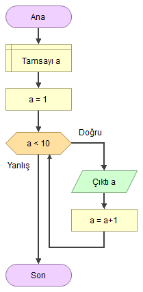

# Döngü Yapıları

Döngüler, belirli bir koşul sağlandığı sürece tekrarlanması gereken işler için kullanılan programlama kodlarıdır. Döngü deyimleri, bahsedilen komut parçalarının belirtilen şartlar gerçekleştikçe tekrar tekrar işlenmesini sağlar. Java’da for, while ve do-while olmak üzere 3 adet döngü deyimi bulunmaktadır.


Kısacası : Döngü yapıları kodumuzun belirli kısımlarının döngüye girmesini ve birden fazla kez çalışmasını sağlar. Döngüler bir koşula bağlanır ve bu koşul var olduğu sürece aynı kod bloğu çalışmaya devam eder. Koşul artık sağlanmıyorsa döngü sona erer.



# 📒 While Döngüsü

While döngüsü Java'nın temel yapı taşlarından bir tanesidir. While terimini yazdıktan sonra yanına bir parantez açılıp kapatılır ve bu parantezler arasına boolean bir değer girilir. Sonrasında bir süslü parantez açılıp kapatılır ve bunun içine kod bloğu yazılır. Bu parantezler içindeki değer doğru(true) olduğu sürece döngü dönmeye devam eder ve kod bloğu çalışır.


While döngüsü söz dizimi şu şekildedir ;

````
while(kosul){
   //kod bloğu
}
````
Burada belirtilen koşul, boolean bir ifadedir. Bu koşul true olduğu sürece döngü devam eder. Koşul false olursa döngü sonlanır. Koşul ifadesi parantez içine yazılır. Eğer döngüye girecek kod tek satırdan oluşuyorsa blok açmaya gerek yoktur; fakat birden fazla satırdan oluşuyorsa mutlaka blok açılmalıdır.
````
int i = 1;
while (i <= 5) {
   System.out.print(i + ',');
   i++;
}
````

Bu Java'da While kullanımı örneğinde, i değeri 5'e eşit ve küçük olduğu sürece döngü çalışmaya devam edecektir ve çıktısı şu şekilde olacaktır ; 1,2,3,4,5,


Döngülerin içeriği olmak zorunda değildir. Bazı durumlarda döngüye girecek kod olmasa bile döngüye girebiliriz. Aşağıdaki örneği inceleyelim:
````
int left = 100, right = 200;
while (++left < --right);
System.out.println("100 ile 200'ün ortası: " + left);
````
Bu algoritma, 100 ile 200’ün arasında tam ortada bulunan sayıyı bulmamızı sağlar. Kodu çalıştırdığımızda çıktısı şu şekilde olur:
````
100 ile 200'ün ortası: 150
````

Gördüğünüz üzere, içeriği olmasa bile bazı durumlarda döngüler fayda sağlayabilir.


Yani while döngüsü genellikle işlemin kaç kez tekrar edeceği bilinmediği durumda kullanılır. Örneğin: müşterinin hesabına giriş şifresini kaç kez yanlış gireceğini bilemeyiz. Bu nedenle bu tarz durumlarda "while" döngüsü tercih edilir hemen aşağıdaki örnekte olduğu gibi.

````
Scanner scanner = new Scanner(System.in);
String customerPassword = "12345";
boolean passwordSuccessfull = false;

while(!passwordSuccessfull) {
	
	System.out.println("Hesap şifrenizi giriniz:");
	String typedPassword = scanner.next();
	
    if(customerPassword.contentEquals(typedPassword)) {
		passwordSuccessfull = true;
		System.out.println("Sisteme başarılı giriş yaptınız!");
	}
}
````
Java programla dilinde while döngüleri yapacağımız işin ne zaman biteceğiniz bilmediğimiz durumlarda kullanışlı olabilmektedir.

# 📒 Do-While Döngüsü

Do-while döngüsünün çalışma mantığı while döngüsü ile aynıdır , fakat while döngüsünde parantez içerisindeki koşul sağlandığı sürece kod bloğu çalışacaktır. Ama Do-while döngüsünde durum false olsa bile döngü en az bir kere çalışacaktır. Bu tür durumlar için Do-while kullanılır.


Java Do-While döngüsü söz dizimi şu şekildedir ;
````
do {
kodlar//
} while (kosul);
````
Gördüğünüz gibi, koşul döngünün sonunda test edilir. Bu durumda, koşul false olsa bile döngü en az bir kere çalıştırılmış olur. Bu şekilde döngü yazmak istediğiniz durumlarla karşılaşacaksınız. Aşağıdaki örneği inceleyelim:

````
int year = 2020;
do
{
	System.out.println(“Döngü işletiliyor..”);
	year++;
} while (year < 2020);
````
Bu kod çalıştırıldığında çıktısı aşağıdaki gibi olur:

````
Döngü işletiliyor..
````
Gördüğünüz gibi year değişkeni 2020’den küçük olmamasına rağmen döngü en az bir kere çalıştırılmıştır.


Java'da Do-While ve While döngüleri arasındaki tek fark , Do-while döngüsünde, döngü bloğu içindeki kod kesimi en az bir kez mutlaka işletilecektir. Çünkü önce döngü bloğu işletilip sonra koşul denetlenmektedir. While döngüsünde ise önce koşula bakılıp sonra döngü bloğu işletildiği için, döngüye hiç girilmemesi olasıdır.

# 📒 For Döngüsü

Java'da döngüler konusunda öğrendiğimiz gibi For döngüsü ile bir koşul belirterek döngülerimizi oluşturabiliriz.

````
for (durum 1; durum 2; durum 3) {
  // çalışacak kod bloğu
}
````
For döngüsü şu şekilde işler: İlk olarak döngüde sayaç işlevi görecek bir değişken oluşturulur. Bu değişkenin ilk değeri [durum 1] ile belirtilen kısımda verilir. Bu değişken [durum 3] kısmında isteğe göre artırılır veya azaltılır. Döngünün hangi koşulda çalışacağı ise [durum 2] kısmında boolean bir ifadeyle belirtilir.

````
for (int i = 0; i < 10; i++) {
  System.out.println(i);
}
````
Bu For Döngüsü örneğinde 1'den 10'a kadar olan sayıları ekrana yazdırdık.


İlk durumda, i adında türü int olan ve varsayılan değeri 0 olan bir değişken tanımladık. Bu değişken bizim kodumuzda sayaç görevi görecektir.


İkinci durumda, döngünün çalışması için gerekli koşulu tanımlar (i, 10'ten küçük olmalıdır). Koşul doğruysa döngü yeniden başlayacak, yanlışsa döngü sona erecektir.


Üçüncü durumda, döngüdeki kod bloğu her çalıştığında değeri 1 arttıran kodumuzu yazdık.


# 📒 For ve While Arasındaki Farklar

Java’da for, while ve do-while olmak üzere 3 adet döngü deyimi bulunmaktadır. Birbirinden farklı bu döngülerden hangisini kullanacağız ?


Hiç bir algoritmada hangi döngünün kullanılması gerektiği ile ilgili kesin bir yargı ve kural söz konusu değildir. Bu döngüler uygun şekilde tasarlandıkları sürece aynı işi yapabilirler. Ama genellikle, kaç kere döneceği belli olmayan, koşulun bir girdiye göre denetlendiği durumlarda While ya da do-while döngüsü kullanılırken, diziler gibi, tekrar sayısı belirli olan durumlarda ise for döngüsü kullanılması tercih edilir. Ama yine bu yazılımcının kendisine bağlıdır.

# 📒 Continue ve Break Komutları

Continue Deyimi


Java'da "continue" deyimi , döngü içinde bir koşul oluştuğunda o döngüyü tamamlamadan bir sonraki kademeye geçmeye yarar.

````
int i = 0;
while (i < 10) {
  i++;
  if (i == 5) {
    continue;
  }
  System.out.println(i);
}
````
Örnekte görüldüğü gibi eğer i değişkeni 5 sayısına eşit olduysa, o kod bloğundan sonraki kodlar çalışmayıp döngü bir sonraki adıma geçiş yapacaktır.


Break Deyimi


Buraya kadar gördüğümüz bütün döngüler belirlediğimiz bir koşula göre kontrol ediliyor ve bu koşul sağlandığı sürece çalışıyordu. Bazı durumlarda, döngü koşulu sağlansa bile başka bir nedenden ötürü döngüyü sonlandırmak isteyebiliriz. Bu tarz durumlarda break deyimini kullanırız. Bu deyim, içinde kullanıldığı döngüyü anında sonlandırır.

````
for (int i = 0; i < 10; i++) {
  if (i == 5) {
    break;
  }
  System.out.println(i);
}
````
Örnekte görüldüğü üzere döngü içinde ki koşul tamamlanmadan i değişkeni 5 değerine ulaştığında "break" komutu ile döngümüzü bitirebiliriz.

# 📙 Return ve Void Tanımı

Java'da iki tür metot mevcuttur bunlar : Return (geri dönüşü olan) , Void (geri dönüşü olmayan) metotlar. Return metotlar çağrıldığında geriye bir değer döndürürken, Void metotlar geriye bir değer döndürmemektedir.


Return Metotlar


Java'da oluşturduğumuz bir metodun bir değer üretmesini istendiğinde, "return" deyimi kullanılır. Metot içerisinde yazılan kod parçacıkları çalışacaktır, buna ek olarak metot içinde oluşturduğumuz bir veriyi dışarıya aktarma ihtiyacı duyabiliriz, bu durumlarda "return" deyimi kullanılır. Geri dönecek değerin veri tipi, metot tanımlarken verdiğimiz veri tipi ile aynı olmalıdır. Aksi halde derleyici tarafından hata alınır.

````
public class Main {
  static int toplam(int x, int y) {
    return x + y;
  }
  public static void main(String[] args) {
    int t = toplam(5,2);
    System.out.println(t);
  }
}
// Çıktısı "7"
````
Void Metotlar


Java'da yazılan bir metodun geriye bir değer döndürmesini istemiyor, sadece metot içindeki kod bloğunun çalışmasını istersek "void" deyimi kullanmalıdır. Metot tanımlanırken veri tipi kısmına "void" deyimi yazılması yeterlidir. Void metotlar içerisinde "return" deyimi kullanılamamaktadır.

````
public class Main {
  static void toplam(int x, int y) {
      System.out.println(x+y);
  }
  public static void main(String[] args) {
    toplam(5,2);
  }
}
// Çıktısı "7"
````

# 📙 Metotlarda Overloading (Aşırı Yüklenme)
 
Java'da, iki veya daha fazla metot, parametreler açısından farklılık gösteriyorsa (farklı sayıda parametre, farklı türde parametre veya her ikisi) aynı isime sahip olabilir. Bu duruma metotlarda "Overloading" yani aşırı yüklenme işlemi denir.


Buradaki amaç aynı işlemi farklı parametrelerle yapacak olan metot ismini tek seferde kullanmaktır. Overloading işlemi "Nesne Yönelimli Programlamada" da çok kullanılmaktadır.

````
void func() { ... }
void func(int a) { ... }
float func(double a) { ... }
float func(int a, float b) { ... }
````
Burada func() metodu (overloading) aşırı yüklenmiştir. Bu metotlar aynı isime sahiptir ancak farklı parametreler kabul eder.


Not: Yukarıdaki metotların dönüş türleri aynı değildir. Bunun nedeni, metot aşırı yüklemesinin dönüş türleriyle ilişkili olmamasıdır. Aşırı yüklenmiş metotlar aynı veya farklı dönüş türlerine sahip olabilir, ancak parametreler açısından farklılık göstermeleri gerekir.

````
public class JavaPatika {static void ekranaYaz(int a) {
        System.out.println("Parametreler : " + a);
    }

    static void ekranaYaz(int a, int b) {
        System.out.println("Parametreler : " + a + " ve " + b);
    }

    public static void main(String[] args) {
        ekranaYaz(5);
        ekranaYaz(10, 2);
    }
}
// Çıktısı :
// Parametreler : 5
// Parametreler : 10 ve 2
````

# 📙 Metotlarda Local Değişken Yapıları

Java'da lokal değişkenler, kod blokları içerisinde tanımlanan değişkenlerdir ve sadece tanımlandıkları kod blokları içerisinde kullanılabilirler. Diğer metot ve sınıflar üzerinden erişimleri yoktur. Lokal değişkenler tanımladıkları ({...}) kod blokları arasında kullanılırlar.

````
public class JavaPatika {
	static void ekranaBas(){
        // Hatalı kullanım 
       System.out.println(a);
    }    
    
    public static void main(String[] args) {
        int a = 10;
        if (a < 10) {
            int b = 20;
            System.out.println(a);
        }
         // Hatalı kullanım 
        System.out.println(b);
    }
}
````
Bu örnekte if blokları arasında tanımlanmış olan integer türünde ki "b" değişkeni, if bloğunun dışında ekrana bastırılmak istenildiğinde hata ile karşılaşılacaktır. Çünkü "b" değişkeni if blokları arasında tanımlanmıştır ve tanımlandığı kod blokları arasında kullanılabilir.


Dikkat edilmesi gereken diğer bir nokta, main metodun içerisinde tanımlanmış olan "a" değişkeni if bloğu içerisinde kullanılabilir, çünkü if bloğu main metodun bir parçasıdır. Ama "a" değişkeni ekranaBas(); metodu içerisinde kullanılamaz, bunun sebebi ise ekranaBas() ve main metodu farklı iki kod bloklarıdır.

# 📙 Recursive (Özyineli) Metotlar

Java'da Recursive Metotlar, bir metodun kendisini çağırma tekniğidir. Bu teknik karmaşık problemleri ,çözmesi daha kolay problemlere ayırmayı sağlar. İki sayıyı birbirine eklemek kolaydır, ancak bir dizi sayıyı birbirine eklemek daha karmaşıktır. Recursive metotlar sürekli kendilerini çağırdıkları için dikkat edilmesi gereken durum en son aşama için koşul koyulmasıdır .Aşağıdaki örnekte recursive ile bir dizi sayıyı , iki sayı ekleme basit görevine bölerek toplamak için kullanılır:

````
public class Main {
  public static void main(String[] args) {
    int sonuc = toplam(10);
    System.out.println(sonuc );
  }
  public static int toplam(int k) {
    if (k > 0) {
      return k + toplam(k - 1);
    } else {
      return 0;
    }
  }
}
````
toplam() metodu çağrıldığında, k'dan küçük tüm sayıların toplamına k parametresini ekler ve sonucu döndürür. K değişkeni 0 olduğunda, metot sadece 0 döndürür. Metot çalışırken, program şu adımları izler:


f(1) = 1;


f(2) = f(1) + 2;


f(3) = f(2) + 3;


f(4) = f(3) + 4;


..........


..........


f(n) = f(n-1) + n;