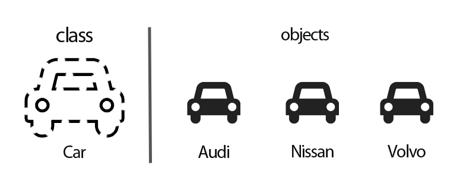
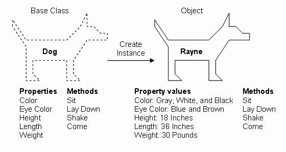
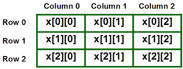
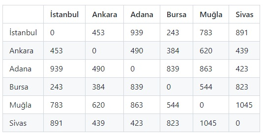
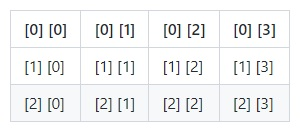
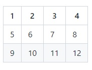

# 📗 Sınıf ve Nesne Kavramları

Nesne (Object) Nedir?


Nesne tanımının TDK'da ki tanımına bir bakalım :


1. İsim belli bir ağırlığı ve hacmi, rengi olan her türlü cansız varlık, şey, obje.


2. İsim, dil bilgisi Geçişli fiili bütünleyen yalın veya belirtme durumunda bulunan tümleç: Ali bir kitap almış cümlesinde kitap nesnedir.


3. İsim, felsefe Öznenin dışında kalan her konu, obje: "Her nesne ve olaya alaycı bir gözle bakmak ilkesinden yola çıkar bu görüş." - Salâh Birsel


Nesnelere Örnekler


1. Araba, telefon, elma, ördek, kalem gibi günlük hayatta kullandığımız eşyalar. 
ü

Bildiğimiz gibi her nesnenin kendine ait nitelikleri ve davranışları vardır. Nesneler birbirlerinden farklıdır ve kendi varoluşlarına göre davranırlar ve kendi kimliklerine sahiptirler.


Nitelik : Nitelik kavramı, bir nesnenin özellikleridir ve nesnenin mevcut durumunu tanımlar. Mesela bir ördeğin rengi ve ağırlığı o ördeğin nitelikleridir. Bir ördeğimiz rengi siyah, diğer ördeğimizin rengi beyazdır. Bu durumda her iki nesne (yani ördek) nitelikleri sebebi ile birbirilerinden bağımsızdırlar.


Davranış : Bir nesnenin kendine özel yaptığı eylemlerdir. Yine ördek örneğine bakarsak, bir ördek uçabiliyorken diğer bir ördek fiziksel durumu gereği uçamayabilir.


Nesneler hakkında bilmemiz gereken bir diğer husus ise, nesneler bir isimdir. Nesnelerin kendilerine ait nitelik ve davranışları vardır.


### Sınıf (Class) Nedir?


NYP sınıflar ve nesneler üzerine kurulmuştur, "Sınıflar" bir problemi soyutlamak ve genelleştirmek için kullanılan yapılardır veya kılavuzlardır. Sınıflar, bir nesneye ait tüm özellikleri temsil eder. Bu özellikler nesnenin ne tür nitelikleri ve davranışları olacağını belirler.


Mesela "Araba" bir sınıftır. Arabalara ait nitelikler renk, hız, vites sayısı, yakıt türü vb. bir sürü nitelik olabilir. Ayrıca bazı arabalara özel davranışlar olabilir, park sensörü, oto pilot, hız sabitleme gibi arabaların kendilerine özel davranışları da olabilir. Bir araba üretilirken, bir yapım kılavuzuna ihtiyaç vardır. Programlama da bu kılavuzlara "Sınıf (Class)" denir.



# 📗 Nesne Yönelik Programlama Nedir?

Nesne Yönelimli Programlama (Object Oriented Programming), sınıflar ve nesneler kavramına dayanan bir programlama yaklaşımıdır. Bu yaklaşımın amacı, ihtiyaç duyulan programı daha küçük parçalara bölerek, yönetilebilir ve yeniden kullanılabilir hale getirmektir. Her küçük parçanın kendine ait özelliği, verileri ve diğer küçük parçalarla nasıl iletişim kuracağı bilgileri bulunur.


NYP’de programlar, nesnelerin birbirileriyle etkileşime geçmeleri sağlanmasıyla tasarlanır. Bizler gerçek hayattaki karmaşıklığı bir şekilde modelleyerek bunu bilgisayarın anlamasını sağlamaktayız. Modelleme, insanın problem çözmek üzere eskiden beri kullandığı bir yöntemdir. Büyükçe bir problemin tamamını zihinde canlandırıp çözmeye çalışmak yerine, oluşturulacak model ya da modeller üzerinde hedef sistemin görünüşü, davranışı ya da bazı durumlarda verdiği tepkiler gözlemlenebilir.


Nesne Yönelimli Programlama ile bizler yapacağımız her şeyi bilgisayarın anlayacağı şekilde modelleyip, “nesne” halinde aktarıyoruz. Böylelikle gerçek hayatta bizim için geçerli olan nesneleri artık bilgisayarların anlayacağı hale getirmiş oluyoruz. Tabi ki kullanılan programlama dilinin bizlere verdiği imkanlar dahilinde. Böylelikle kodlayan kişi ile bilgisayar arasında dilden bağımsız bir anlaşma, bir felsefe ortaya çıkmış oluyor. Artık bizim için “araba” nesnesi ne anlama geliyorsa, bilgisayar için de aynı anlama geliyor.


### Neden Nesne Yönelimli Programlama?

1. NYP, hızlı ve uygulaması kolay bir yaklaşımdır.
2. NYP, programlar için net bir yapı sağlar. 
3. NYP, "Don't Repeat Yourself" yani "Kendini Tekrar Etme" ilkesini uygular ve kodun bakımını, düzenlenmesini ve hata ayıklamasını kolaylaştırır. 
4. NYP, daha az kod ve daha kısa geliştirme süresiyle, yeniden kullanılabilir uygulamalar oluşturmayı mümkün kılar. 
5. NYP, yapıya daha sonradan yeni özellikler ekleyerek genişletilebilirlik sağlar. 
6. NYP, problemleri gerçek hayattaki işlemlere göre modeller. 

# 📗 Modelleme ve Soyut Düşünme

Gerçek hayattaki problemleri bilgisayarın sanal ortamında çözebilmek için, ilk önce problemin uygun şekilde bilgisayar ortamına aktarılması gerekmektedir. Bu işlem “soyutlama (abstraction)” ya da “modelleme (modeling)” olarak anılır.


Modelleme, insanın problem çözmek üzere eskiden beri kullandığı bir yöntemdir. Büyükçe bir problemin tamamını zihinde canlandırıp çözmeye çalışmak yerine, oluşturulacak model ya da modeller üzerinde hedef sistemin görünüşü, davranışı ya da bazı durumlarda verdiği tepkiler gözlemlenebilir.


Model, var olan ya da gerçekleştirilmesi planlanan bir sistemi anlamak ya da anlatmak üzere oluşturulabilir ve birçok farklı alanda etkili bir şekilde kullanılmaktadır. Örneğin, bir toplu konut inşaatını müşterilerine tanıtmak isteyen bir inşaat firması, binaların yerleşimlerini, renk ve göreli büyüklüklerini görsel olarak ifade eden maket ya da maketler hazırlar. Bu maketi inceleyen bir kimse, almak istediği konutun nerede olduğunu, okul binasına yakınlığını ya da anayola ulaşımın nasıl olduğunu görerek değerlendirebilir. Burada model makettir ve “hedef sistemi anlatmak” amacını yerine getirmektedir.


Bir sistemle ilgili birden çok model oluşturulabilir. Tek bir model ile sistemin tamamını görmeye çalışmak yerine, üzerinde çalışılan sistemin farklı yönlerini öne çıkaran modeller hazırlanabilir. Örneğin inşaat firması toplu konutu müşterilere anlatmak üzere estetik tasarımı ön plana çıkan bir maket hazırlarken, bu toplu konut projesindeki binaların elektrik tesisatı için farklı, su tesisatı için farklı, genel daire görünümü için farklı projeler hazırlar. Böylece aynı sistemin farklı yönleriyle ilgilenen kimseler, yalnızca kendilerini ilgilendiren yönü öne çıkaran model üzerinde çalışma olanağı bulurlar.


Modelin mutlaka elle tutulur olması da gerekmez. Bilgisayar benzetimi ile de çeşitli modeller oluşturulabilir. Örneğin bir uçağın havadaki hareketini incelemek üzere geliştirilmiş bir bilgisayar benzetimi ile uçak modellenebilir. Kanat uzunluğu ya da gövde eğimi gibi parametrelerle oynanarak uçağın farklı hava koşullarında nasıl davranacağı anlaşılmaya çalışılabilir. Burada, sistemin davranışını anlamak amacıyla, sanal ortamda oluşturulmuş bir model söz konusudur.



# 📗 Sınıf Tanımları

Java Nesne Yönelimli bir programlama dilidir. Java'daki her şey, değişkenleri ve metotları ile birlikte sınıflar ve nesnelerle ilişkilidir. Örneğin: gerçek hayatta araba bir nesnedir. Otomobilin ağırlık ve renk gibi değişkenleri ve sürüş ve fren gibi metotları vardır. Nesne yönelimli programlamanın amacı yazdığımız kodlara soyut bir kavrama dönüştürmektir.


Sınıflara ait nitelikler ve davranışlar vardır. Programlamada nitelikler için değişkenler (variable) ,davranışlar için ise metotlar (method) tanımlanır.


### Sözdizimi (Syntax)

````
class <class_name> {
	<variable>;
	<methods>;
}</methods></variable></class_name>
````
Java'da "sınıf" tanımlanırken "class" deyimi kullanılır ve sonrasında sınıf ismi yazılır. Java'da sınıf isimleri her zaman büyük harf ile başlaması gerekmektedir ve oluşturulan Java dosyası ile aynı isimde olmalıdır.


Sınıf ismini de verdikten sonra "{" işareti ile sınıfa ait kapsamı yani kod bloğunu oluştururuz. "}" parantezi ile de sınıfa ait kapsamı kapatırız. Böylece, sınıfımız için yazacağımız kodlar "{}" arasında kalan alanda yazılacaktır. Bu da sınıfın kapsamını ifade eder.


Sınıf kod bloğunu açtıktan sonra bu kod bloğu için değişkenleri ve metotları yazarız. Unutmayınız ki metotlar da kendilerine ait kod blokları, yani kapsamları vardır. Onları da "{}" ile belirtiriz.

````
class Car {
    // nitelikler
    String type;
    String model;
    String color;
    int speed;

    // davranışlar
    int increaseSpeed(int increment) {
        speed += increment;
        return speed;
    }

    int decreaseSpeed(int decrease) {
        if (speed > 0) {
            speed -= decrease;
        }
        return speed;
    }
    
    void printSpeed() {
        System.out.println("Speed : " + speed);
    }
    // ...
}
````
Yukarıda sınıf ve fonksiyon tanımlamalarına detaylıca yer verilmiştir.


Sınıflar nesneler oluşturabilmek için yazılım dünyasında oluşturulmuş şablonladır. Bu şablon nesne ile ilgili modellenecek tüm özellikleri ve davranışları bir taslak halinde kodlanmasını sağlar. Böylece, tanımlanmış bir sınıftan binlerce nesne oluşturabiliriz.


# 📗 Nesne Oluşturma ve Sınıf Metotları


Sınıflar nesneleri tarif eden şablonlardı. Nesneler ise bu şablonlardan üretilen fiziksel yapılardır. Her üretilen nesne Hesap Hafıza Bölgesi'nde tutulur. Böylece sınıftan fiziksel karşılığı olan bir yapı elde etmiş oluruz. Sınıftan onlarca, yüzlerce nesne yaratabiliriz. Hepsi de hafıza başka adresleri gösterirler.

````
public class Car {
    // nitelikler
    String type;
    String model;
    String color;
    int speed;

    // davranışlar
    int increaseSpeed(int increment) {
        speed += increment;
        return speed;
    }

    int decreaseSpeed(int decrease) {
        if (speed > 0) {
            speed -= decrease;
        }
        return speed;
    }
    
    void printSpeed() {
        System.out.println("Speed : " + speed);
    }
    // ...
}
````
Java'da nesne üretmek için kullanılan sözdizimi :

````
ClassName object = new ClassName();  
````
1. ClassName : Nesne oluşturmak istediğimiz sınıfı belirtiyoruz. Bu sınıf daha öncesinde projemizde tanımlanmış olması gerekmektedir. 
2. object : Nesnemize verdiğimiz isimdir ve aynı isimde birden fazla nesne oluşturulamaz. 
3. new : Java'da nesne üretmek için "new" anahtar kelimesini kullanırız. 
4. ClassName(); : Sınıfa ait Kurucu (Constructor) Metodu temsil eder. Varsayılan olarak parametresiz tanımlanır. 

Car sınıfına ait örnek nesne oluşturma :

````
Car audi = new Car();
Car bmw = new Car();
Car mercedes = new Car();
````
Yukarıdaki örnekte "Car" sınıfına ait 3 tane farklı nesne ürettik. Bu nesnelerin her birinin nitelikleri farklı olmakla beraber hafızada ayrı ayrı yer kaplamaktadırlar.


### Sınıf Niteliklerine Erişim


Sınıflara ait niteliklere erişim sağlamak için nokta (.) kullanılır. İlgili nesnenin ismini sonuna nokta koyularak erişilmek istenilen niteliğin ismi yazılır.

````
public class Main {
    public static void main(String[] args) {
        Car audi = new Car();
        audi.speed = 10;
        System.out.println("Audi Hızı : " + audi.speed);

        Car bmw = new Car();
        bmw.speed = 25;
        System.out.println("Bmw Hızı : " + bmw.speed);

        Car mercedes = new Car();
        mercedes.speed = 30;
        System.out.println("Mercedes Hızı : " + mercedes.speed);

    }
}
````
Programın çıktısı :

````
Audi Hızı : 10
Bmw Hızı : 25
Mercedes Hızı : 30
````
### Sınıf Metotlarına Erişim


Sınıfa ait davranışlara yani metotlara erişmek için nokta (.) kullanılır. İlgili nesnenin ismini sonuna nokta koyularak erişilmek istenilen metodun ismi yazılır ve var ise parametreleri girilir.

````
public class Main {
    public static void main(String[] args) {
        Car audi = new Car();
        audi.speed = 10;
        audi.increaseSpeed(20);
        audi.printSpeed();

        Car bmw = new Car();
        bmw.increaseSpeed(10);
        bmw.increaseSpeed(25);
        bmw.increaseSpeed(5);
        bmw.decreaseSpeed(25);
        bmw.printSpeed();

        Car mercedes = new Car();
        mercedes.speed = 20;
        mercedes.printSpeed();

    }
}
````
Programın çıktısı :

````
Speed : 30
Speed : 15
Speed : 20
````

# 📗 Constructor (Yapıcı) Metot Kullanımı

Kurucu metotlar sınıf tasarlanırken yazılırlar. Sınıfınızı yazarken kurucu metotlarınızı da tanımlayabilirsiniz. Eğer sınıf içinde hiç kurucu metot tanımlamazsınız parametresiz boş bir kurucu metot Java tarafından otomatik olarak tanımlanır.


Kurucu metotlar ilgili sınıftan bir nesne üretmeye çalıştığınızda daha nesne üretme aşamasında çalıştırılan özel metotlardır (fonksiyonlardır). Kurucu metotların isimleri Sınıf ismiyle aynı olmak zorundadır. Dönüş tipi olarak veya void olarak herhangi bir tanımlama yapılmasına gerek yoktur.


"new" anahtar kelimesi ile nesne üretirken kurucu metot çağrımı yapılır. İki tip kurucu metot vardır:


1. Parametresiz Varsayılan Kurucu Metot 
2. Parametreli Kurucu Metot 

Car sınıfımız :

````
public class Car {
    // nitelikler
    String type;
    String model;
    String color;
    int speed;

    // Constructor (Kurucu) Metot
    Car(String type, String model, String color) {
        this.type = type;
        this.model = model;
        this.color = color;
        this.speed = 0;
    }

    // davranışlar
    int increaseSpeed(int increment) {
        speed += increment;
        return speed;
    }

    int decreaseSpeed(int decrease) {
        if (speed > 0) {
            speed -= decrease;
        }
        return speed;
    }

    void printSpeed() {
        System.out.println("Speed : " + speed);
    }

    void printInfo() {
        System.out.println("================");
        System.out.println("Model : " + this.model);
        System.out.println("Color : " + this.color);
        System.out.println("Type : " + this.type);
        System.out.println("Speed : " + this.speed);
    }
    // ...
}
````
Nesnelerimiz :

````
public class Main {
    public static void main(String[] args) {
        Car audi = new Car("Sports", "Audi", "red");
        audi.increaseSpeed(20);
        audi.printInfo();

        Car bmw = new Car("Sports" , "BMW" , "blue");
        bmw.increaseSpeed(10);
        bmw.increaseSpeed(25);
        bmw.increaseSpeed(5);
        bmw.decreaseSpeed(25);
        bmw.printInfo();

        Car mercedes = new Car("Corporate" , "Mercedes" , "black");
        mercedes.speed = 20;
        mercedes.printInfo();

    }
}
````
Programın çıktısı :

````
================
Model  : Audi
Color  : red
Type  : Sports
Speed  : 20
================
Model  : BMW
Color  : blue
Type  : Sports
Speed : 15 ================
Model  : Mercedes
Color  : black
Type  : Corporate
Speed  : 20
````

# 📗 Tek Boyutlu Diziler

Tek boyutlu diziler basitçe, aynı türden elemanların listesini tutan bir yapıdır. Dizi oluşturmak için, önce dizide yer alacak elemanların türü belirtilir, sonra diziye bir isim verilir ve isimden sonra köşeli parantezler ( [ ve ] ) konulur.

````
int numbers[]; // Burada numbers isminde bir dizi oluşturuluyor
````
Köşeli parantezleri değişken isminden sonra koymak yerine, tür isminden sonra da yazabilirsiniz. Örneğin aşağıdaki kodun yukarıdakiyle bir farkı yoktur:

````
int[] numbers; // Burada numbers isminde bir dizi oluşturuluyor
````
Diziler new deyimiyle oluşturulur. Dizi oluştururken kapasite değeri vermek zorunludur. Kapasite değeri, dizinin kaç eleman barındıracağını belirtir. Aşağıdaki örnekte, 5 adet int değişkeni tutabilecek bir dizi oluşturuluyor:

````
int[] numbers = new int[5];
````
Bu ifade çalıştırıldığında, hafızada 5 adet int değişken için yetecek kadar alan ayrılır. Bu alanı düzenleyebilmek için indeks numaraları kullanırız. Dizi indeksleri 0’dan başlar ve kapasitenin 1 eksiğine kadar gider. Örneğin, yukarıdaki dizinin indeksleri 0’dan 4’e kadardır. Şimdi bu dizinin ilk elemanını verelim:

````
numbers[0] = 10; // Dizinin ilk elemanı 10 olarak ayarlandı.
````
Dizinin diğer elemanlarını şu şekilde verelim:

````
numbers[1] = 15;
numbers[2] = 20;
numbers[3] = 25;
numbers[4] = 30;
````
Bu kodlar çalıştırıldığında dizinin elemanları sırasıyla aşağıdaki gibi olur:

````
{ 10, 15, 20, 25, 30 }
````

Aşağıdaki kodu çalıştırdığınızda konsola 25 yazar:

````
System.out.println(numbers[3]);
````
Dizilerle uğraşırken indeks numaralarına çok dikkat etmelisiniz. Eğer dizinin aralığı dışında bir indekse erişmeye çalışırsanız, *IndexOutOfBoundsException* hatası meydana gelir.

````
System.out.println(numbers[5]); // Hata!
````
Yukarıdaki satır hataya neden olur; çünkü numbers dizisinin kapasitesi 5 olmasına rağmen dizinin 6. elemanına erişmeye çalışıyoruz.


Eğer dizinin içindeki elemanlar dizi oluşturulurken belliyse, diziyi oluştururken elemanları küme parantezi içinde ve virgülle birbirinden ayırarak verebiliriz:

````
String[] weekDays = new String[] { "Pazartesi", "Salı", "Çarşamba", "Perşembe", "Cuma", "Cumartesi", "Pazar" };
````
Bu şekilde oluşturulan dizilere kapasite vermemize gerek yoktur; çünkü kapasite değeri zaten eleman sayısından bellidir. Yukarıdaki örnekte weekDays dizisinin kapasitesi otomatik olarak 7 olur.


Yukarıdaki gibi dizi oluştururken new deyimini kullanmaya gerek yoktur. Yani, yukarıdaki kodu aşağıdaki gibi yazabiliriz:

````
String[] weekDays = { "Pazartesi", "Salı", "Çarşamba", "Perşembe", "Cuma", "Cumartesi", "Pazar" };
````
### Dizinin Kapasitesini Öğrenmek


Her dizinin length adında bir özelliği bulunur. Bu özelliği kullanarak dizinin kapasitesini öğrenebilirsiniz.


Örneğin, aşağıdaki kodu inceleyelim:

````
int[] numbers = new int[100];
System.out.println(numbers.length); // Konsolda 100 yazar
````
### Dizinin Bir Elemanını Değiştirme

````
String[] cars = {"Volvo", "BMW", "Ford", "Mazda"};
cars[0] = "Opel";
cars[2] = "Toyota";

System.out.println(cars[0]);
````

# 📗 Çok Boyutlu Diziler

Java'da Çok Boyutlu Diziler varsayılan bir veri tipi olarak bulunmazlar ve matris olarak adlandırılırlar. Dizilerin 2 boyutlu halleri şeklinde tanımlanırlar. Matrisler satır ve sütun şeklinde tablo verisi formatındaki verileri tutmak için kullanılır. Diziler liste halinde veriler için uygunken, matrisler tablo şeklindeki veriler için uygundur. Oluşturulan tabloda bir değere ulaşmak istersek satır ve sütun sayısını girmemiz yeterli olacaktır.


İki boyutlu dizilerde tek boyutlu diziler gibi indis değeri 0'dan başlar. Dizide tutulacak veri tipleri aynı olmak zorundadır farklı veri tiplerini aynı matriste tutamayız.


3x3 boyutunda bir matris örneği :




Tablo oluşturup bu tablonun bilgilerini matris ile gösterelim. Örneğin, şehirler arasındaki mesafeyi gösteren bu tabloyu uzaklık değişkenimizde sakladık.


Mesafe Tablosu(KM)



````
int[][] uzaklik ={
                {0, 453, 939, 243, 783, 891},
                {453, 0, 490, 384, 620, 439},
                {939, 490, 0, 839, 863, 423},
                {243, 384, 839, 0, 544, 823},
                {783, 620, 863, 544, 0, 1045},
                {891, 439, 423, 823, 1045, 0}
        };
````
### İki Boyutlu Dizi Tanımlama Yöntemleri


İki boyutlu dizileri oluşturmanın farklı yöntemleri var şimdi bunlara bakalım.


Bir değişkenin dizi olduğunu köşeli parantezler ile belirtmiştik. Bir tane köşeli parantez tek boyutlu dizi belirtir. Eğer çok boyutlu dizi oluşturmak istiyorsak, boyut sayısı kadar köşeli parantez belirtmeliyiz. Örneğin aşağıdaki satır 2 boyutlu bir dizi (yani matris) belirtir:

````
degiskenTipi[][] arrayIsmi;
int matrix[][];
````
yada

````
degiskenTipi arrayIsmi[][];  //bu yöntem tercih edilmez
````
İki boyutlu dizimizi tanımlarken değerlerini atamak istersek aşağıdaki yöntemi kullanabiliriz.

````
int[][] array = {
{1, 2, 3}, 
{4, 5, 6}, 
{7, 8, 9}, 
{10, 11, 12} 
};
````
İlk köşeli parantez birinci boyutu (satırları), diğeri ise ikinci boyutu (sütunları) belirtir. Aşağıdaki kodu çalıştırırsak, 3 satırlı ve 4 sütunlu bir matris oluşturur:

````
int matrix[][] = new int[3][4];
````
yada

````
matrix = new int[3][4];
````
oluşturulan matrix değişkeninin default değeri (a) ile gösterilen tablodaki gibidir.

````
[0][1][2][3]
[0] 0 0 0 
[1] 0 0 0 
[2] 0 0 0 

    (a)
````
Bu matrisin bütün elemanlarına ulaşmak için kullanmamız gereken indeks numaralarını aşağıdaki tabloda görebilirsiniz:



````
matrix[1][2]; // Matrisin 2. satır ve 3. sütunundaki elemana erişiliyor
matrix[0][3]; // Matrisin 1. satır ve 4. sütunundaki elemana erişiliyor
matrix[2][0]; // Matrisin 3. satır ve 1. sütunundaki elemana erişiliyor
````
Matrisin 2. satırı ve 3. sütununda yer alan değerini 7 yapalım.

````
matrix[2][1] = 7;
````
Atadığımız 7 değerine ulaşmak istersek matrix[2] [][][1] ifadesini kullanırız.


Fark ettiğiniz gibi matrislerin dizilerden tek farkı [] parantez yanına bir tane [] açıyoruz. Zaten her [] ifadesi yeni bir boyut anlamına geliyor. "double[][][] ucBoyutlu;" şeklinde bir ifadeyle 3 boyutlu veri saklayan bir veri yapısı oluşturmuş oluyoruz.


Şimdi güzel bir örnek yapalım. 3 satırdan ve 4 sütundan oluşan bir matris yaratalım ve bu matrisin elemanlarını sırayla 1’den başlayacak şekilde dolduralım. Aşağıdaki kodu inceleyelim:

````
int[][] matrix = new int[3][4];
int number = 1;

for (int x = 0; x < matrix.length; x++)
{
	int[] row = matrix[x];

    for (int y = 0; y < row.length; y++)
	{	
		row[y] = number;
		number++;
	}
}
````
Şimdi yukarıdaki kodu inceleyelim. İki boyutlu diziyi oluşturduktan sonra önce for döngüsüyle dizinin satırlarını geziyoruz. Daha sonra içerideki for döngüsüyle dizinin sütunlarını dolaşıyoruz. Bu örneği vermemizdeki amaç, matrisin elemanlarına ulaşmak için iç içe 2 for döngüsü kullanmak gerektiğini göstermektir. Ayrıca dizinin length metodunun faydasını da burada görmüş oluyoruz.


Yukarıdaki kod çalıştığında matrisin elemanları şu şekilde olur:




### İç İçe Döngülerle Dizilere Erişim ve Dizi İşlemleri


Aşağıdaki kod bize bi matris değerini ekrana nasıl yazdıracağımızı gösterir. Döngüye girdikten sonra her sütun sayısı her satır için tek tek ekrana bastırılır. Her bir satırın tamamlanmasından sonra System.out.println() ile bir alt satıra geçilir.

````
for (int row = 0; row < matrix.length; row++) {
   for (int column = 0; column < matrix[row].length; column++) {
       System.out.print(matrix[row][column] + " "); 
}
    System.out.println(); 
}
````
İki boyutlu diziler aslında her satırının tek boyutlu olduğu dizilerdir. Çok boyutlu dizilerinde boyutuna ulaşarak işlem yapabiliriz.


Örneğin x = new int[3] [][][4] arrayinin x[0], x[1], x[2] değerleri tek boyutlu dizidir. Ve her biri aşağıdaki şekilde gösterildiği gibi 4 elemanı vardır. x.length değeri 3'tür, yani bize sahip olduğu 3 satırın değerini verir. Sütun sayısına ise her hangi bir satır değerinin uzunluğu kadardır. x[2].length değeri 4'tür.


Yukarıda öğrendiğimiz konuları pekiştirmek adına aşağıdaki kodu inceleyelim.

````
public double[][] multiplyMatrices(double[][] firstMatrix, double[][] secondMatrix) {

	// firstMatrix.length ile ilk matrisin satır sayısını buluyoruz. örneğimizde 3 olarak gelecektir.
	// secondMatrix[0].length ile ikinci matrisin sütun sayısını buluyoruz. örneğimizde 4 olarak gelecektir.

	// C matrisi olacak olan matrisi tanımlıyoruz.
    double[][] result = new double[firstMatrix.length][secondMatrix[0].length];
 
 	// matrislerde çarpma, toplama gibi işlemleri yapabilmek için iç içe 3 tane döngüye ihtiyaç duyarız.
    for (int row = 0; row < result.length; row++) {
        for (int col = 0; col < result[row].length; col++) {
            result[row][col] = multiplyMatricesCell(firstMatrix, secondMatrix, row, col);
        }
    }
 
    return result;
}
````
````
double multiplyMatricesCell(double[][] firstMatrix, double[][] secondMatrix, int row, int col) {
	// A matrisinin satırı ile B matrisinin sütunu çarpma işlemi.
	/*
	*   row = 3, col = 4  olarak gelecektir.
	*   i = 0 ise
	*   firstMatrix[3][0] * secondMatrix[0][4] 
	*   i = 1 ise
	*   firstMatrix[3][1] * secondMatrix[1][4] 
	*   i = 2 ise
	*   firstMatrix[3][2] * secondMatrix[2][4] 
	* şeklinde i değişerek satır ve sütun çarpılır.
	*/
    double cell = 0;
    for (int i = 0; i < secondMatrix.length; i++) {
        cell += firstMatrix[row][i] * secondMatrix[i][col];
    }
    return cell;
}
````
Yukarıdaki “multiplyMatrices” fonksiyonu iki tane matrisi girdi olarak alır. Fonksiyon matrislerin çarpım sonucunu matris olarak döndürür.


“multiplyMatrices” fonksiyonu içinde bir başka fonksiyon daha çağrılmıştır. “multiplyMatricesCell” bu fonksiyon ise iki matrisin satır ve sütununu çarpıp sonucu double tipte bir değer döndürür.


### Sütun Kapasiteleri Farklı Matris Oluşturmak - Düzensiz Diziler


Farklı sütun değerine sahip dizilere "Ragged Arrays" yani düzensiz diziler denir. Başka bir açıdan bakıldığında ise, 2 boyutlu dizileri, dizilerin dizisi (array of arrays) olarak düşünmek doğru olur. Yani iki boyutlu dizileri tek boyutlu diziler oluşturur.


Diziler aynı türden elemanlardan oluşmak zorundadır. int türünde bir dizi olabileceği gibi, dizinin dizisi de olabilir.


Yukarıdaki örneklerde matrisin sütun sayısını 4 olarak belirledik. Bu şekilde oluşturulursa matrisin bütün satırları 4 elemanlı olur. Fakat bu zorunlu değildir. Matris oluştururken sütun sayısı belirlemezsek, her bir satırdaki dizilerin kapasitesi farklı olabilir. Örneğin aşağıdaki kodu inceleyelim:

````
int[][] matrix = new int[3][];
matrix[0] = new int[1];
matrix[1] = new int[2];
matrix[2] = new int[3];
````
Burada önce 3 satırdan oluşan bir matris belirttik, fakat sabit bir sütun sayısı vermedik. Sonra her bir satır için ayrı ayrı sütun sayısı belirledik.


Çok boyutlu dizi oluştururken, yalnızca ilk boyutun (en soldaki) kapasitesini belirlemeniz yeterlidir. Diğer boyutların kapasitesini dinamik olarak belirleyebilirsiniz.


### Alıştırma


Aşağıda verilen örneklerin cevaplarına bakmadan önce kendiniz kodlamaya çalışmanızı öneririz. Daha sonra zorlandığınız noktalarda ufak yardımlar almak için bakabilirsiniz. Bu sizin öğrenmenize daha yardımcı olacaktır.


Matris boyutunu sizin belirlediğiniz matris değerlerini ise kullanıcının girdiği bir algoritma yazınız.


Cevap:

````
int matrix[][] = new int[3][4];
        Scanner input = new Scanner(System.in);
        System.out.println("Enter " + matrix.length + " rows and "
                + matrix[0].length + " columns: ");
        for (int row = 0; row < matrix.length; row++) {
            for (int column = 0; column < matrix[row].length; column++) {
                matrix[row][column] = input.nextInt();
            }
        }
````
İstediğiniz boyutta matris oluşturarak matris değerlerine 0-99 arası random sayılar üreterek matrise atama yapınız.


Cevap:

````
int[][] matrix = new int[3][4];
        for (int row = 0; row < matrix.length; row++) {
            for (int column = 0; column < matrix[row].length; column++) {
                matrix[row][column] = (int) (Math.random() * 100);
            }
        }
````
Aşağıdaki kod bloğunun çıktısı nedir?

````
  int[][] array = {{1, 2}, {3, 4}, {5, 6}};
        for (int i = array.length - 1; i >= 0; i--) {
            for (int j = array[i].length - 1; j >= 0; j--) {
                System.out.print(array[i][j] + " ");
            }
            System.out.println();
        }
````
Cevap:

````
6 5 
4 3 
2 1 
````

# 📗 ForEach Kullanımı

ava'da ForEach deyimi adında da anlaşılacağı gibi bir döngüyü ifade eder. Genelde dizilerdeki ve listelerdeki elemanları daha hızlı şekilde ulaşmak için kullanılan kısa bir yöntemdir. Kısacası for döngüsünün modifiye edilmiş halidir.

````
for (veritipi degisken: diziAdi) {
  // kod bloğu
}
````
Örnekte Java'da ForEach kullanımını görmektesiniz, yine bir for döngüsü oluşturuyoruz ama iki parametreyi iki nokta ile ayırıyoruz. İlk kısmında dizinin döndüreceği veri tipini ve for içinde dizinin elemanı olarak kullanacağınız değişkeni tanımlıyorsunuz, diğer kısımda ise dizimizin ismini yazıyoruz.


Bu örneğimizde arabalar dizisinin forEach ile nasıl kullanıldığını görmektesiniz.

````
String[] arabalar = {"BMW", "Mercedes", "Ford", "Ferrari"};
for (String i : arabalar) {
  System.out.println(i);
}

// Çıktısı
// BMW
// Mercedes
// Ford
// Ferrari 
````
Çok boyutlu dizilerde forEach kullanımı

````
public class Main {public static void main(String[] args) {
        int[][] matris = {
                {1, 2, 3},
                {4, 5, 6},
                {7, 8, 9},
                {10, 11, 12}
        };

        for (int[] u : matris) {
            for (int elem : u) {
                System.out.println(elem);
            }
        }
    }
}
````

# 📗 Arrays Sınıfı ve Metotları

Java.util paketindeki Arrays sınıfı, Java Collection Framework'ün bir parçasıdır. Bu sınıf, Java dizilerini dinamik olarak oluşturmak ve bunlara erişmek için statik metotlar sağlar. Yalnızca statik metotlar ve Object sınıfının metotlarından oluşur. Bu sınıfın metotları, sınıf adının kendisi tarafından kullanılabilir.

````
import java.util.Arrays;
````
Import deyimi ile java.util.Arrays sınıfını projeye dahil etmemiz gerekmektedir.


### Arrays.toString()


Diziye ait elemanları direk ekrana basmak için kullanılan bir metottur.

````
import java.util.Arrays;

public class Main {
    public static void main(String[] args) {
        int[] dizi = {3, 5, 79, 12, 25, -3, 66, 82, -49, 152};
        System.out.println(Arrays.toString(dizi));
    }
}

// Çıktısı
// [3, 5, 79, 12, 25, -3, 66, 82,-49,152]
````
### Arrays.fill()


Arrays.fill metodu ile dizilerimizin belirli bir bölümlerine değerler atayabiliriz.

````
import java.util.Arrays;

public class Main {
    public static void main(String[] args) {
        int[] liste = {15, 1, 99, 7, 7, -22, 11, 2, -49, 52};

        Arrays.fill(liste, 2);
        System.out.println(Arrays.toString(liste));

        int[] liste2 = {15, 1, 99, 7, 7, -22, 11, 2, -49, 52};

        Arrays.fill(liste2, 3, 5, 7);
        System.out.println(Arrays.toString(liste2));
    }
}

// Çıktısı
// [2, 2, 2, 2, 2, 2, 2, 2, 2, 2]
// [15, 1, 99, 7, 7, -22, 11, 2, -49, 52]
````
### Arrays.sort()


Arrays.sort() metodu ile dizilerdeki elemanları sıralayabiliriz.


import java.util.Arrays;
````
public class Main {
    public static void main(String[] args) {
        int[] liste = {6, 1, 55, 21, 33, -321, -21, 2, -11, 27};
        Arrays.sort(liste);
        System.out.println(Arrays.toString(liste));
    }
}
// Çıktısı
// [-321, -21, -11, 1, 2, 6, 21, 27, 33, 55]
````
### Arrays.binarySearch()


Java'da dizideki bir elemanın indis değerini bulmak için binarySearch kullanılabilir. Ama bu metodu kullanabilmek için, dizinin sıralı olması gerekmektedir.

````
import java.util.Arrays;

public class Main {
    public static void main(String[] args) {
        int[] liste = {6, 1, 55, 21, 33, -321, -21, 2, -11, 27};

        Arrays.sort(liste);
        System.out.println(Arrays.toString(liste));

        int index = Arrays.binarySearch(liste, 33);
        System.out.println("33'ün indeksi :" + index);
    }
}
// [-321, -21, -11, 1, 2, 6, 21, 27, 33, 55]
// 33'ün indeksi :8
````
### Arrays.copyOf() ve Arrays.copyOfRange() metotu


Mevcut diziden belli bir uzunlukta yeni bir dizi oluşturmak için Arrays.copyOf() metotu kullanılır


Mevcut diziden belli bir aralıkta yeni bir dizi oluşturmak için ise Array.copyOfRange() metodu kullanılır.

````
import java.util.Arrays;

public class Main {
    public static void main(String[] args) {
        int[] liste = {6, 1, 55, 21, 33, -321, -21, 2, -11, 27};

        int[] copyArray = Arrays.copyOf(liste, 3);
        System.out.println(Arrays.toString(copyArray));

        int[] copyOfRangeArray = Arrays.copyOfRange(liste, 0,5);
        System.out.println(Arrays.toString(copyOfRangeArray));
    }
}
// [6, 1, 55]
// [6, 1, 55, 21, 33]
````
### Arrays.equals() metotu


Java'da iki dizinin eşitliğini kontrol etmek için Arrays.equals() metotu kullanılır.

````
import java.util.Arrays;

public class Main {
    public static void main(String[] args) {
        int[] list1 = {1, 2, 3};
        int[] list2 = {1, 2, 3};
        int[] list3 = {1, 2, 10};

        System.out.println(Arrays.equals(list1, list2)); // true
        System.out.println(Arrays.equals(list2, list3)); // false
    }
}
````

